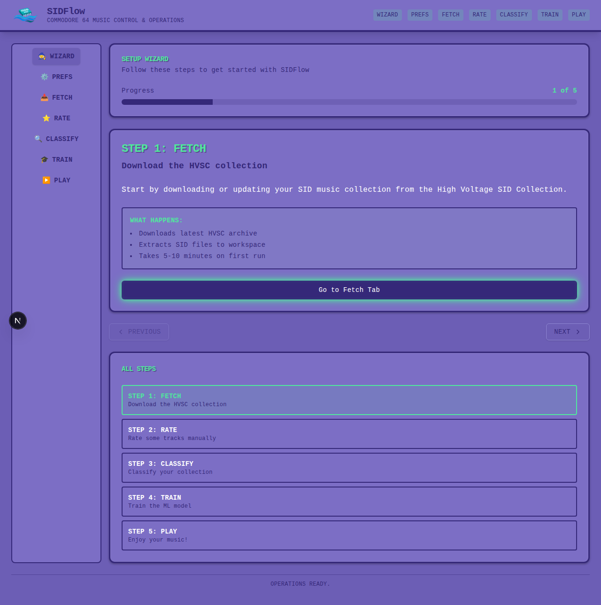
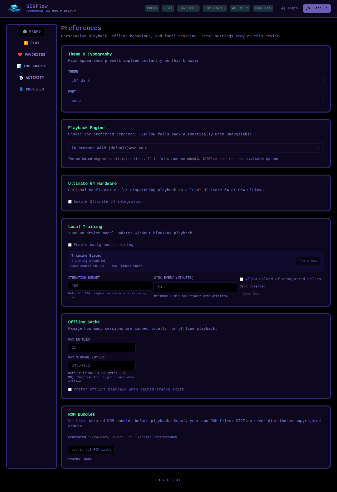
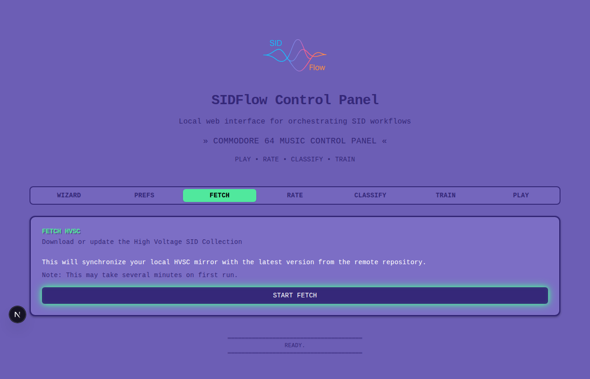
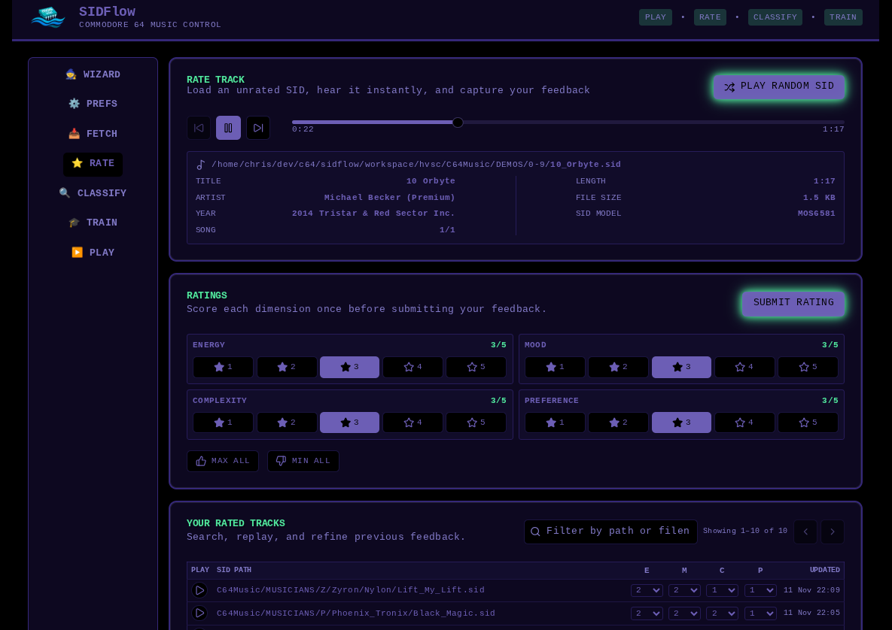
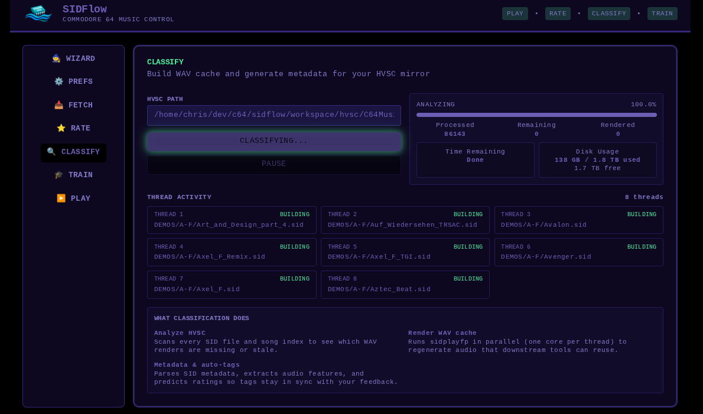
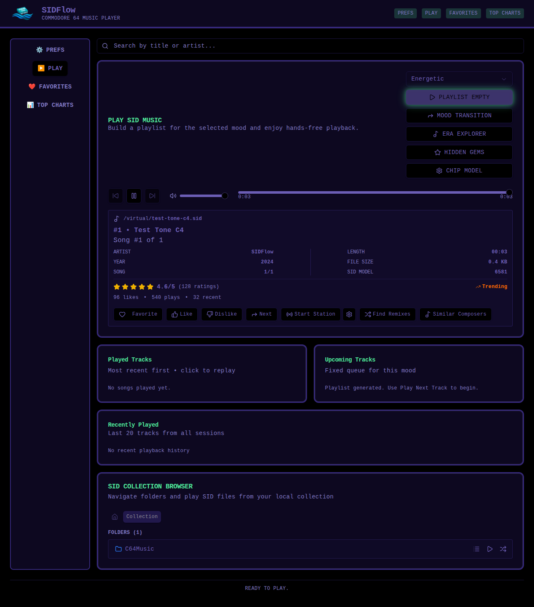

<!-- markdownlint-disable-next-line MD041 -->


# SID Flow

Listen to C64 music based on your mood – automatically classified (under development) and ready to play.

[](https://github.com/chrisgleissner/sidflow/actions/workflows/ci.yaml)
[](https://codecov.io/github/chrisgleissner/sidflow)
[](https://www.gnu.org/licenses/old-licenses/gpl-2.0.en.html)
[](doc/developer.md)

---

## Overview

**SID Flow** helps you rediscover your C64 music collection by automatically organizing songs by *energy*, *mood*, and *complexity*.  Whether you have thousands of SID files from the [High Voltage SID Collection](https://www.hvsc.c64.org/) or your own archive, SID Flow creates mood-based playlists and radio stations tailored to your taste.  

No more random browsing – just tell it what kind of music you want, and it will build a queue for you.

---

## Features

✨ **Smart Classification**

- Automatically rates songs for energy, mood, and complexity
- Uses audio feature extraction (tempo, spectral centroid, RMS energy)
- Default: deterministic heuristic based on file paths and metadata
- Optional: ML-based rating with TensorFlow.js (`--predictor-module`)

🎵 **Personalized Recommendations**

- Learns from your likes, dislikes, and listening patterns
- Stations improve over time based on your feedback
- LanceDB vector similarity search finds tracks you'll love
- Adjustable personalization and discovery balance

🎮 **Easy to Use**

- Simple web UI
- Command-line tools for scripting

🔄 **Reproducible**

- All data stored in human-readable formats (JSON/JSONL)
- Version control friendly

---

## Getting Started

### Install Bun

First install Bun, the all-in-one toolkit for developing modern Typescript applications, as per https://bun.com/docs/installation:

macOS and Linux:

```sh
curl -fsSL https://bun.com/install | bash
```

Windows:

```sh
powershell -c "irm bun.sh/install.ps1|iex"
```


### Build Project

Then install and build this project:

```bash
git clone https://github.com/chrisgleissner/sidflow.git
cd sidflow
bun run build
```

## Deployment

SIDFlow supports two deployment platforms:

- **[Fly.io](doc/fly-deployment.md)** (Recommended) - Cloud platform with automatic scaling, global edge network, and instant deployment
- **[Docker / Raspberry Pi](doc/deployment.md)** - Self-hosted deployment on local hardware or cloud VMs

**Docker images:**  
- `ghcr.io/chrisgleissner/sidflow:<version>` (e.g., `v0.3.10`)  
- [ghcr.io/chrisgleissner/sidflow:latest](https://github.com/chrisgleissner/sidflow/pkgs/container/sidflow)

### Quick Deploy to Fly.io

```bash
# Install flyctl
curl -L https://fly.io/install.sh | sh

# Deploy to staging
./scripts/deploy/fly-deploy.sh -e stg

# Deploy to production
./scripts/deploy/fly-deploy.sh -e prd -t v0.3.29
```

See **[Fly.io Deployment Guide](doc/fly-deployment.md)** for complete instructions.

## Run with Docker

See **Deployment Guide** for full Docker instructions, CLI usage, health checks, and smoke-testing: [doc/deployment.md](doc/deployment.md).

Standard production scenario:

```bash
docker run -p 3000:3000 \
  -e SIDFLOW_ADMIN_USER=admin \
  -e SIDFLOW_ADMIN_PASSWORD='strong-password' \
  -v /path/to/hvsc:/sidflow/workspace/hvsc \
  -v /path/to/wav-cache:/sidflow/workspace/wav-cache \
  -v /path/to/tags:/sidflow/workspace/tags \
  -v /path/to/data:/sidflow/data \
  ghcr.io/chrisgleissner/sidflow:latest
```
Web UI: <http://localhost:3000> (admin at `/admin`).

## Run Locally

Development mode with hot reload:

```bash
cd packages/sidflow-web
bun run dev
```

Production mode (after `bun run build`):

```bash
cd packages/sidflow-web
bun run start
```

Web UI: <http://localhost:3000> (admin at `/admin` with default user/password of `admin/password`).

## Performance Tests

Run the unified performance suite (Playwright + k6) with the shared runner:

```bash
# Build and start the web app first (see Deployment above)
npm run perf:run -- --env local --base-url http://localhost:3000 --results performance/results --tmp performance/tmp --execute
```

- Local mode downsizes to a quick smoke (1 user, minimal iterations, relaxed thresholds).
- CI/nightly mode runs full variants; see [`doc/performance/performance-test.md`](doc/performance/performance-test.md) for details and flags.
- Remote/staging runs stay disabled unless you pass `--env remote --enable-remote --base-url <url>` intentionally.
- k6 HTML dashboards come from `K6_WEB_DASHBOARD=true K6_WEB_DASHBOARD_EXPORT=report.html`.
- CI Docker image already prebakes k6 v0.52.0 and Playwright Chromium to avoid slow downloads.

---

## Web UI

For those who prefer a graphical interface, SID Flow includes a **Next.js + React** control panel with two interfaces:

### Two Access Points

- **Public Player** at **<http://localhost:3000>** - Simple playback interface for casual listening
- **Admin Console** at **<http://localhost:3000/admin>** - Full pipeline control and operations

```bash
cd packages/sidflow-web
bun run dev
```

### Admin Authentication

The admin console requires authentication for security:

- **Default Username:** `admin` (configurable via `SIDFLOW_ADMIN_USER`)
- **Default Password:** `password` (configurable via `SIDFLOW_ADMIN_PASSWORD`)

⚠️ **Security Warning:** The default password `password` is for development convenience only. **Always set a strong `SIDFLOW_ADMIN_PASSWORD` in production.**

- Local runs: place `SIDFLOW_ADMIN_PASSWORD=<strong-password>` in a root-level `.env`; launch scripts (`scripts/start-release-server.sh`, deploy/install scripts) will load it automatically.
- Fly.io GitHub Actions deploys: add repository secret `SIDFLOW_ADMIN_PASSWORD` (optionally `SIDFLOW_ADMIN_PASSWORD_STG` / `SIDFLOW_ADMIN_PASSWORD_PRD`) and the workflow will push it to Fly secrets before deploying.

For full authentication details, see [Web UI Documentation](./doc/web-ui.md).

### Public Player Features

The public interface at **<http://localhost:3000>** provides:

- **Play Tab** - Mood-based playback with presets (Quiet, Ambient, Energetic, Dark, Bright, Complex)
- **Preferences** - Local theme and font settings

### Admin Console Features

The admin interface at **<http://localhost:3000/admin>** provides full system control:

#### Wizard

First-time setup walks you through selecting your HVSC root and confirming cache locations.



#### Preferences

Tweak themes, fonts, render engines, ROM paths, and collection settings.



#### Fetch HVSC

Download and synchronize the High Voltage SID Collection.



#### Rate

Manually rate songs on energy, complexity, mood, and preference. Ratings are collected as feedback data that can be used to train personalized models.



#### Classify

Automatically analyze your entire collection using audio features.



#### Play

Create mood-based queues with full playback controls and history.



### Feature Details

#### 🔍 Smart Search

- Real-time search with instant results
- Search by song title or artist name
- Results dropdown with play-on-click
- Keyboard shortcut: **S** to focus search
- 300ms debounce for smooth typing

#### ❤️ Favorites Collection

- Heart icon to favorite tracks instantly
- Dedicated Favorites tab for quick access
- "Play All Favorites" and "Shuffle Favorites" buttons
- Syncs across browser sessions
- Build your curated collection

#### 📊 Top Charts

- See most-played tracks by the community
- Filter by time range: This Week, This Month, All Time
- Discover popular artists and rising trends
- Track metadata with play counts
- Quick play from any chart entry

#### ⌨️ Enhanced Keyboard Shortcuts

- **SPACE** - Play/Pause
- **Arrow Keys** - Next/Previous, Volume Up/Down
- **M** - Mute toggle
- **S** - Focus search bar
- **F** - Focus favorites
- **?** - Show shortcuts help
- Smart context: Auto-disabled in input fields

#### 🎨 Theme System

- Three themes: C64 Light, C64 Dark, Classic
- Instant theme switching from Prefs tab
- Theme persistence across sessions
- Dark mode for extended listening

#### 📻 ML-Powered Station from Song

- "Start Station" button creates radio based on a seed song
- Uses LanceDB vector similarity search to find similar tracks
- Adjustable parameters:
  - **Personalization** (0-100%): Weight user feedback (likes/dislikes)
  - **Discovery** (0-100%): Balance similarity vs variety
- Generates a 20-track queue
- Station name displays seed song

#### ⭐ Enhanced Rating Display

- Personal rating badge: "You rated: ★★★★☆"
- Community rating with count: "★★★★☆ 4.2/5 (1.2K)"
- Hover tooltip shows E/M/C dimensions
- "Trending" badge for hot tracks
- Visual feedback for likes/plays

#### 🗂️ SID Browser

- Navigate folder structure with breadcrumbs
- Browse by composer, game, or demo group
- Play individual songs or entire folders
- Folder actions:
  - Play All in Folder (non-recursive)
  - Play Folder Tree (recursive)
  - Shuffle Folder Tree
- File metadata display (title, author, subsongs)

#### 🔊 Volume Control

- Volume slider with speaker icon
- Range: 0-100% with 1% precision
- Keyboard: Arrow Up/Down (+/-10%), M to mute
- Visual feedback for volume level
- Mute preserves volume setting

#### 🕐 Recently Played History

- Automatic tracking of last 100 tracks
- Display last 20 in Play tab sidebar
- "Play Again" button per entry
- "Clear History" to reset
- Circular buffer prevents unbounded growth

For a complete user guide covering all features, see [User Guide](./doc/user-guide.md).

### Additional Features

- Play and control SID playback by mood
- Trigger HVSC fetch and training jobs
- Real-time system feedback and status display
- RESTful API and [OpenAPI Spec](packages/sidflow-web/openapi.yaml)

Documentation: [packages/sidflow-web/README.md](packages/sidflow-web/README.md)

---

## Command-Line Tools

If you prefer automation or terminal workflows, use the CLI tools documented in the [Technical Reference](./doc/technical-reference.md).

### Available CLIs

- **[sidflow-fetch](packages/sidflow-fetch/README.md)** - Sync HVSC collection from official mirrors
- **[sidflow-classify](packages/sidflow-classify/README.md)** - Classify songs automatically
- **[sidflow-train](packages/sidflow-train/README.md)** - Train the ML model on feedback
- **[sidflow-rate](packages/sidflow-rate/README.md)** - Manually rate songs interactively
- **[sidflow-play](packages/sidflow-play/README.md)** - Play mood-based playlists

---

## Config

The `.sidflow.json` file defines where SIDFlow should read your SID collection along with other runtime paths:

```json
{
  "sidPath": "./workspace/hvsc",
  "wavCachePath": "./workspace/wav-cache",
  "tagsPath": "./workspace/tags",
  "threads": 0,
  "classificationDepth": 3
}
```


## Developer Documentation

- **[Technical Reference](doc/technical-reference.md)** – architecture, CLI tools, APIs  
- **[Developer Guide](doc/developer.md)** – setup, testing, contributions  
- **[Performance Metrics](doc/performance-metrics.md)** – benchmarks  
- **[Artifact Governance](doc/artifact-governance.md)** – data management  
- **[Release Readiness](doc/release-readiness.md)** – npm publication strategy and assessment

---

## Acknowledgements

SID Flow is [GPLv2](LICENSE)-licensed and builds upon outstanding open-source software and datasets:

| Component | License | Source | Credit |
|------------|----------|---------|-----|
| **Bun** | MIT | [github.com/oven-sh/bun](https://github.com/oven-sh/bun) | Fastest Typescript runtime |
| **libsidplayfp** | GPL v2+ | [github.com/libsidplayfp/libsidplayfp](https://github.com/libsidplayfp/libsidplayfp) | Most accurate software SID emulator (compiled to WASM for cross-platform playback) |
| **High Voltage SID Collection (HVSC)** | Free for personal use | [hvsc.c64.org](https://www.hvsc.c64.org/) | Largest SID collection |
