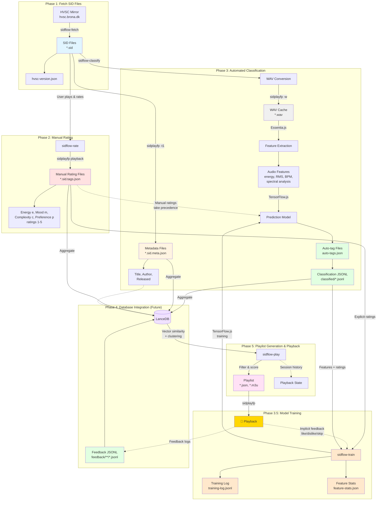

# SID Flow

Classify any C64 song collection: from raw SID tunes to mood-driven playlists.

[](https://github.com/chrisgleissner/sidflow/actions/workflows/ci.yml)
[](https://codecov.io/github/chrisgleissner/sidflow)
[](https://www.gnu.org/licenses/old-licenses/gpl-2.0.en.html)
[](doc/developer.md)

**SID Flow** contains various CLI scripts to process any SID library - such as the High Voltage SID Collection ([HVSC](https://www.hvsc.c64.org/)) or your own archive - to extract structure, mood, and complexity. It builds deterministic playlists that you can play directly or integrate into existing workflows.

> [!NOTE]
> This project is in active development. Several features mentioned below are planned but not yet implemented.

---

## Requirements

- [Bun](https://bun.com/docs/installation) ≥ 1.1.10 - for executing Typescript
- [sidplayfp](https://github.com/libsidplayfp/sidplayfp) in your `PATH` (or specify with `--sidplay <path>`) - for SID playback and WAV rendering
- [7-Zip](https://www.7-zip.org/download.html) - for archive extraction  

Place a `.sidflow.json` configuration file beside this README before running any tool.  
Default structure:

```json
{
  "hvscPath": "./workspace/hvsc",
  "wavCachePath": "./workspace/wav-cache",
  "tagsPath": "./workspace/tags",
  "sidplayPath": "sidplayfp",
  "threads": 0,
  "classificationDepth": 3
}
```

Validate configuration anytime:

```bash
bun run validate:config
```

---

## Technical Components

SID Flow uses three main technical components for song analysis, classification, and recommendation:

### 1. Essentia.js (Feature Extraction)

- **Purpose**: Extracts low-level and mid-level audio descriptors from WAV files converted from SID songs
- **Type**: Deterministic DSP library (non-learned)
- **Input**: WAV audio signal of a SID tune
- **Output**: Numeric feature vector per song — e.g. energy, RMS, spectral centroid, rolloff, zero-crossing rate, BPM, and duration
- **Usage**: Provides the raw measurable properties of each song; these values form the input to all later stages

### 2. TensorFlow.js (Supervised Prediction / Learning)

- **Purpose**: Learns the subjective relationship between extracted features and how users perceive songs
- **Type**: Supervised regression model trained on user feedback (explicit ratings and implicit likes/dislikes/skips)
- **Input**: Feature vectors + labelled training data
- **Output**: Predicted ratings for:
  - **e** – energy/intensity (1-5)
  - **m** – mood/optimism vs somberness (1-5)
  - **c** – complexity/melodic & structural sophistication (1-5)
  - plus an optional confidence value
- **Usage**: Converts objective signal descriptors into human-meaningful perception ratings and adapts over time as more feedback is collected
- **Training**: Periodically retrained via `sidflow-train` CLI command or automatically during playback (future)

### 3. LanceDB (Vector Store / Clustering / Retrieval)

- **Purpose**: Stores all song feature vectors and predicted ratings in a searchable vector database
- **Type**: Unsupervised / similarity-based retrieval engine
- **Input**: Combined numeric representation of each song (Essentia features + TensorFlow-predicted ratings)
- **Output**: Clusters and nearest-neighbour queries that identify related or similar songs
- **Usage**:
  - Builds k-means clusters for mood/energy spaces
  - Generates personalized "radio stations" or playlists based on user profiles and exploration settings
  - Supports fast similarity lookups when a user wants "songs like this one"

### Overall Relationship

```
Essentia.js → Extracts objective features
     ↓
TensorFlow.js → Learns and predicts subjective ratings from those features
     ↓
LanceDB → Organizes, clusters, and retrieves songs based on combined feature + rating vectors
```

---

## Workflow Overview

The diagram below shows how the SIDFlow tools work together to process SID files, create classifications, and generate playlists:



**Legend:**
- **Blue boxes**: SID source files
- **Red boxes**: Manual rating files (user-created)
- **Gray boxes**: WAV cache (intermediate format)
- **Green boxes**: Auto-generated rating files and JSONL data
- **Orange boxes**: Training outputs (model training phase)
- **Tan boxes**: Metadata files
- **Purple boxes**: Database (future)
- **Pink boxes**: Playlists
- **Gold boxes**: Playback

---

## CLI Tools

Each command can be run via the command line interface from the repository root.

### 1. `sidflow-fetch`

```sh
./scripts/sidflow-fetch [--remote <url>] [--version-file <path>] [--config <path>] [--help]
```

**Status:** Done  
**Purpose:** Keep a reproducible HVSC or custom SID mirror for downstream processing.  
**Operation:** Downloads the latest base archive, applies missing deltas, and records version metadata in `hvsc-version.json`.

**Key flags**

- `--remote <url>` — mirror root (default: `https://hvsc.brona.dk/HVSC/`)  
- `--version-file <path>` — custom location for version metadata  
- `--config <path>` — alternate configuration file  
- `--help` — show usage  

**Outputs**

- Updated SID tree under `hvscPath`  
- Refreshed `hvsc-version.json` containing version and checksum data  

---

### 2. `sidflow-rate` (formerly `sidflow-tag`)

```sh
./scripts/sidflow-rate [--sidplay <path>] [--config <path>]
```

**Status:** Available  
**Purpose:** Capture user ratings across multiple dimensions for supervised classification and preference learning.  
**Operation:** Plays unrated `.sid` files via `sidplayfp`, records energy/mood/complexity/preference (`e/m/c/p`) ratings, and stores results beside each track.

**Controls**

- `e1-5`, `m1-5`, `c1-5`, `p1-5` — set dimension values (default 3)  
- `Enter` — save and advance  
- `Q` — quit safely while saving progress  

**Outputs**

- Deterministic `*.sid.tags.json` files with timestamps and version markers  

**Note:** The tool was renamed from `sidflow-tag` to `sidflow-rate` to better reflect its purpose of capturing numerical ratings rather than categorical tags. The new `p` (preference) dimension captures overall user preference/enjoyment.

---

### 3. `sidflow-classify`

```sh
./scripts/sidflow-classify [--config <path>] [--sidplay <path>] [--force-rebuild]
                            [--feature-module <path>] [--predictor-module <path>]
                            [--metadata-module <path>] [--render-module <path>]
```

**Status:** In development with Essentia.js + TensorFlow.js integration available  
**Purpose:** Convert SIDs to WAV, extract features, merge manual ratings, and publish deterministic `auto-tags.json` summaries.  
**Operation:** Rebuilds the WAV cache, captures metadata (falling back to path heuristics when `sidplayfp` is missing), derives feature vectors using Essentia.js, and predicts `(e/m/c/p)` ratings using TensorFlow.js for unrated dimensions without overwriting manual values.

#### Flags (classification)

- `--config <path>` — alternate `.sidflow.json`
- `--sidplay <path>` — override `sidplayfp` binary for WAV + metadata extraction
- `--force-rebuild` — re-render WAV cache even if fresh
- `--feature-module <path>` — custom Bun/ESM module exporting `featureExtractor`
- `--predictor-module <path>` — custom module exporting `predictRatings`
- `--metadata-module <path>` — custom module exporting `extractMetadata`
- `--render-module <path>` — custom module exporting `render` hook (handy for tests)

#### Outputs (classification)

- Deterministic WAV cache under `wavCachePath`
- Per-SID metadata files (`*.sid.meta.json`)
- Aggregated `auto-tags.json` files respecting `classificationDepth`
- Summary of auto/manual/mixed rating coverage on stdout
- **Performance metrics** (runtime, cache hit rate, predictions generated) — see [`doc/performance-metrics.md`](doc/performance-metrics.md)
- **JSONL classification output** — structured data format for further processing

> [!TIP]
> The CLI now includes Essentia.js for feature extraction and TensorFlow.js for rating prediction. Features extracted include energy, RMS, spectral centroid, spectral rolloff, zero crossing rate, and BPM. The TF.js model uses a lightweight neural network architecture. For production use, train the model with your labeled data. See [`packages/sidflow-classify/README-INTEGRATION.md`](packages/sidflow-classify/README-INTEGRATION.md) for details on customization and training.

#### JSONL Classification Output

The classification pipeline can output results in **JSONL** (JSON Lines) format, with one classification record per line. This format is ideal for:

- **Small diffs** — Line-based format produces minimal Git diffs
- **Easy merges** — Append-only structure reduces merge conflicts  
- **Stream processing** — Can be read line-by-line for large datasets
- **Database import** — Direct import into vector databases like LanceDB

**JSONL Schema:**

Each line contains a JSON object with:
- `sid_path` — Full relative path within HVSC (e.g., `"Rob_Hubbard/Delta.sid"`)
- `ratings` — Nested object with dimensions: `e` (energy), `m` (mood), `c` (complexity), `p` (preference)
- `features` — Optional nested object with all extracted audio features (energy, rms, spectralCentroid, spectralRolloff, zeroCrossingRate, bpm, confidence, duration)

**Example JSONL:**

```jsonl
{"sid_path":"Rob_Hubbard/Delta.sid","ratings":{"e":3,"m":4,"c":5,"p":4},"features":{"energy":0.42,"rms":0.15,"spectralCentroid":2150,"bpm":128}}
{"sid_path":"Martin_Galway/Parallax.sid","ratings":{"e":2,"m":5,"c":4,"p":5},"features":{"energy":0.18,"rms":0.09,"spectralCentroid":1850,"bpm":96}}
```

**Pretty-print JSONL for human review:**

```bash
bun run format:json data/classified/classification.jsonl output.json
```

The `format:json` command converts JSONL to indented JSON. Omit the output path to print to stdout.

**VS Code Support:**

Install the "JSON Lines" extension for syntax highlighting and validation of `.jsonl` files.

---

### 4. `sidflow-train`

```sh
../scripts/sidflow-train [--epochs <n>] [--batch-size <n>] [--learning-rate <n>]
                          [--evaluate] [--no-evaluate] [--force] [--config <path>]
```

**Status:** Available  
**Purpose:** Train the ML model on explicit ratings and implicit feedback to improve predictions.  
**Operation:** Loads classification records and feedback events, merges them with weighted samples (explicit=1.0, like=0.7, dislike=0.5, skip=0.3), computes feature normalization statistics, trains the TensorFlow.js model, and saves results in Git-friendly formats.

#### Key Flags

- `--epochs <n>` — Number of training epochs (default: 5)
- `--batch-size <n>` — Training batch size (default: 8)
- `--learning-rate <n>` — Learning rate (default: 0.001)
- `--evaluate` — Evaluate on test set (default: true)
- `--no-evaluate` — Skip test set evaluation
- `--force` — Force complete retraining from scratch
- `--config <path>` — Alternate configuration file

#### Outputs

- Updated model weights (`data/model/model.json`, `data/model/weights.bin` — not in Git)
- Feature normalization statistics (`data/model/feature-stats.json` — in Git)
- Model metadata with architecture and metrics (`data/model/model-metadata.json` — in Git)
- Training history log (`data/training/training-log.jsonl` — in Git)
- Aggregated training samples (`data/training/training-samples.jsonl` — in Git)

#### Training Process

1. **Load Data**: Read classification records from `data/classified/*.jsonl` and feedback events from `data/feedback/YYYY/MM/DD/*.jsonl`
2. **Merge Samples**: Combine explicit ratings (manual) and implicit feedback (play/like/dislike/skip) with appropriate weights
3. **Feature Stats**: Compute and save normalization statistics (means/stds) for all audio features
4. **Train Model**: Use Adam optimizer with MSE loss to train the neural network
5. **Evaluate**: Compute MAE and R² metrics on held-out test set (20% by default)
6. **Persist**: Save model weights (binary, not committed), metadata, and training summary (JSON, committed)

#### Model Architecture

- **Input**: 8 features (energy, rms, spectralCentroid, spectralRolloff, zeroCrossingRate, bpm, confidence, duration)
- **Hidden**: Dense(32, ReLU) → Dropout(0.2) → Dense(16, ReLU)
- **Output**: Dense(3, tanh) → mapped to [1-5] for energy, mood, complexity

#### Training Summary Example

Each training run appends a summary to `data/training/training-log.jsonl`:

```json
{
  "modelVersion": "0.2.0",
  "trainedAt": "2025-11-03T18:30:00Z",
  "samples": 842,
  "metrics": { "mae": 0.41, "r2": 0.86 },
  "featureSetVersion": "2025-11-03",
  "notes": "Trained on 750 samples (500 explicit, 250 implicit)"
}
```

> [!TIP]
> The model improves as you collect more ratings and feedback. Run training periodically after rating sessions to update predictions. Future versions will support automatic periodic retraining during playback.

---

### 5. `sidflow-play`

```sh
./scripts/sidflow-play [--mood <preset>] [--filters <expr>] [--export <path>] [--export-format <fmt>]
```

**Status:** Available  
**Purpose:** Turn your classified collection into a dynamic SID playlist experience with mood-based recommendations.  
**Operation:** Uses LanceDB vector similarity and the recommendation engine to generate personalized playlists based on mood presets or custom filters. Streams through `sidplayfp` with queue controls and exports deterministic manifests.

#### Key Flags

- `--mood <preset>` — Mood preset: quiet, ambient, energetic, dark, bright, complex
- `--filters <expr>` — Filter expression (e.g., `e>=4,m>=3,bpm=120-140`)
- `--limit <n>` — Number of songs in playlist (default: 20)
- `--exploration <0-1>` — Exploration factor (default: 0.2, higher = more diversity)
- `--diversity <0-1>` — Diversity threshold (default: 0.2, minimum distance between consecutive songs)
- `--sidplay <path>` — Override sidplayfp executable
- `--export <path>` — Export playlist to file
- `--export-format <fmt>` — Export format: json, m3u, m3u8 (default: json)
- `--export-only` — Export playlist without playing
- `--play-only` — Play without interactive controls
- `--config <path>` — Alternate configuration file

#### Filter Syntax

Build complex filters using dimension ranges:

- `e>=4` — Energy >= 4 (high energy songs)
- `m<=2` — Mood <= 2 (somber/dark mood)
- `c=5` — Complexity = 5 (exactly 5)
- `p>=4` — Preference >= 4 (highly preferred songs)
- `bpm=120-140` — BPM between 120 and 140
- `e>=4,m>=3,c<=2` — Multiple filters (comma-separated)

#### Mood Presets

Quick mood-based playlist generation:

| Preset | Energy | Mood | Complexity | Description |
|--------|--------|------|------------|-------------|
| quiet | 1 | 2 | 1 | Low energy, calm mood, simple arrangements |
| ambient | 2 | 3 | 2 | Moderate energy, neutral mood |
| energetic | 5 | 5 | 4 | High energy, upbeat mood |
| dark | 3 | 1 | 3 | Moderate energy, somber mood |
| bright | 4 | 5 | 3 | High energy, upbeat mood |
| complex | 3 | 3 | 5 | High complexity focus |

#### Playback Features

- **Queue Management**: Load and play songs sequentially
- **Playback Controls**: Skip, pause, resume (via graceful shutdown)
- **Session History**: Automatic tracking of played songs
- **Graceful Fallbacks**: Continues playback even if some files fail

#### Export Formats

**JSON** — Full playlist with metadata and ratings:
```json
{
  "metadata": {
    "createdAt": "2025-11-03T12:00:00Z",
    "seed": "energetic",
    "count": 20
  },
  "songs": [
    {
      "sid_path": "Rob_Hubbard/Delta.sid",
      "score": 0.95,
      "ratings": { "e": 5, "m": 5, "c": 4, "p": 5 },
      "features": { "bpm": 140, "energy": 0.8 }
    }
  ]
}
```

**M3U** — Simple playlist for external players:
```
Test/Song1.sid
Test/Song2.sid
```

**M3U8** — Extended M3U with metadata:
```
#EXTM3U
#EXTINF:180,Song1.sid
Test/Song1.sid
#EXTINF:210,Song2.sid
Test/Song2.sid
```

#### Session Persistence

Each playback session is automatically tracked and persisted:

- Session ID with timestamp
- Playlist seed (mood or custom)
- History of played songs
- Statistics (total played, skipped, errors)
- Deterministic JSON format in `data/sessions/`

#### Examples

**Generate and play an energetic playlist:**
```bash
./scripts/sidflow-play --mood energetic --limit 30
```

**Export a quiet playlist without playing:**
```bash
./scripts/sidflow-play --mood quiet --export quiet-playlist.json --export-only
```

**High-energy songs with BPM matching:**
```bash
./scripts/sidflow-play --filters "e>=4,m>=4,bpm=130-150" --limit 25
```

**Export M3U playlist with custom filters:**
```bash
./scripts/sidflow-play --filters "e>=3,p>=4" --export playlist.m3u --export-format m3u
```

**Balanced exploration mode:**
```bash
./scripts/sidflow-play --mood ambient --exploration 0.5 --diversity 0.3
```

#### Outputs

- **Live Playback**: Streams selected tracks through sidplayfp
- **Playlist Files**: JSON (with metadata) or M3U/M3U8 (for external players)
- **Session History**: Persisted in `data/sessions/session-*.json`

> [!TIP]
> Use `--exploration` to control the balance between familiar favorites and discovering new songs. Higher values (0.5-1.0) introduce more diversity, while lower values (0.0-0.3) stick closer to your known preferences.

---

## LanceDB Vector Database

SIDFlow uses LanceDB to combine classification data and user feedback into a unified vector database for efficient similarity search and recommendation queries.

### Building the Database

```sh
bun run build:db [--config <path>] [--update-manifest]
```

**Purpose:** Rebuild the LanceDB vector database from canonical JSONL source files  
**Operation:** Combines `classified/*.jsonl` and `feedback/**/*.jsonl` files, aggregates feedback statistics, and creates a searchable vector database with manifest.

#### How it works

1. Reads all classification records from `data/classified/*.jsonl`
2. Reads all feedback events from `data/feedback/YYYY/MM/DD/events.jsonl`
3. Aggregates feedback by SID path (likes, dislikes, skips, plays, last_played)
4. Creates rating vectors `[e, m, c, p]` for similarity search
5. Writes `data/sidflow.lance/` database (binary, excluded from Git)
6. Generates `data/sidflow.lance.manifest.json` with checksums and statistics (committed to Git)

#### Database Schema

Each record in the database contains:

- `sid_path` — Primary identifier (string)
- `vector` — Rating vector `[e, m, c, p]` for similarity search (float array)
- `e`, `m`, `c`, `p` — Individual rating dimensions (1-5)
- `features_json` — All audio features as JSON string (energy, RMS, BPM, spectral analysis, etc.)
- `likes`, `dislikes`, `skips`, `plays` — Aggregated feedback counts
- `last_played` — Most recent play timestamp (ISO 8601)

#### Manifest File

The manifest (`data/sidflow.lance.manifest.json`) tracks:

- Schema version and creation timestamp
- Record count and statistics
- SHA256 checksums of source data (classified and feedback)
- Enables verification and reproducibility

#### Rebuild Policy

- Database is **derived** (not committed to Git) - rebuild after cloning
- Rebuild is **deterministic** - same inputs produce same database
- Run `bun run build:db` after:
  - Cloning the repository
  - Pulling new classification or feedback data
  - Adding new classifications or feedback events

---

## User Feedback Logging

SIDFlow includes an append-only feedback logging system for tracking user interactions with SID files. This enables personalized recommendations and usage analytics.

### Feedback Actions

Four action types are supported with defined weights for recommendation scoring:

- `play` — Neutral observation (weight: 0.0)
- `like` — Strong positive signal (weight: +1.0)
- `skip` — Mild negative signal (weight: -0.3)
- `dislike` — Strong negative signal (weight: -1.0)

### Storage Format

Feedback events are stored in **date-partitioned JSONL files**:

```
data/feedback/
├── 2025/
│   └── 11/
│       └── 03/
│           └── events.jsonl
```

**Example feedback log:**

```jsonl
{"ts":"2025-11-03T12:10:05Z","sid_path":"Rob_Hubbard/Delta.sid","action":"play"}
{"ts":"2025-11-03T12:11:10Z","sid_path":"Martin_Galway/Parallax.sid","action":"skip"}
{"ts":"2025-11-03T12:12:22Z","sid_path":"Rob_Hubbard/Delta.sid","action":"like"}
```

### Validation

Validate feedback logs for correctness and detect duplicate UUIDs:

```bash
bun run validate:feedback [feedback-path]
```

The validator checks:
- JSON syntax correctness
- Required fields presence
- Valid action types
- Duplicate UUID detection

### Merge-Friendly Design

The append-only structure and date partitioning minimize Git merge conflicts:
- Each event is a single line
- Files are organized by date (YYYY/MM/DD)
- Optional UUIDs enable deduplication across devices
- Chronological ordering preserved within files

---

## Typical Workflow

1. `bun run validate:config` — verify configuration  
2. `./scripts/sidflow-fetch` — download or refresh your SID mirror  
3. `./scripts/sidflow-rate` — manually rate songs to provide seeds for classification
4. `./scripts/sidflow-classify` — automatically classify all songs based on ratings
5. `./scripts/sidflow-train` — train the ML model on ratings and feedback to improve predictions
6. `bun run build:db` — rebuild vector database from classifications and feedback
7. `./scripts/sidflow-play` — generate mood-based playlists and play curated sets

All generated data (HVSC mirror, WAVs, ratings) stays under `workspace/` and is git-ignored by default. The LanceDB database (`data/sidflow.lance/`) and trained model weights (`data/model/*.bin`, `data/model/model.json`) are also git-ignored but can be rebuilt deterministically from source data.

---

## Troubleshooting

### Fetching HVSC

- Retries manifest and archive downloads up to three times.  
- On persistent errors, use `--remote` with an alternate mirror.  
- Delete partial archives if extraction fails and rerun.  
- Ensure `7z` is installed and accessible on your `PATH`.  
- If `hvsc-version.json` drifts from actual content, remove it to trigger a clean re-sync.

---

## Development

Setup details, structure, and testing are described in [`doc/developer.md`](doc/developer.md).

Artifact governance policies (canonical vs. derived data, Git policies, rebuild procedures) are documented in [`doc/artifact-governance.md`](doc/artifact-governance.md).

---

## License

GPL v2 — see `LICENSE`.
