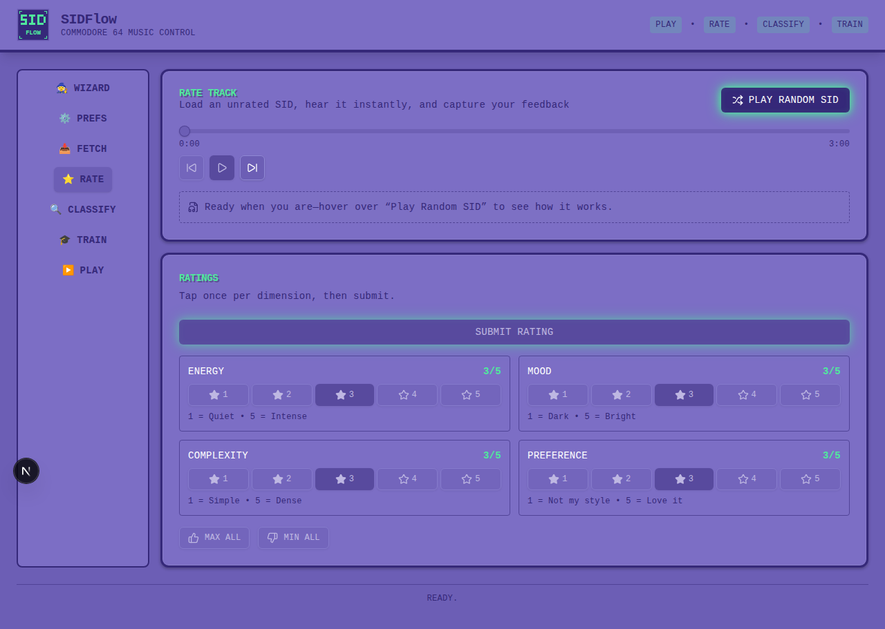

<!-- markdownlint-disable-next-line MD041 -->


# SID Flow

Listen to C64 music based on your mood – automatically classified (under development) and ready to play.

[](https://github.com/chrisgleissner/sidflow/actions/workflows/ci.yaml)
[](https://codecov.io/github/chrisgleissner/sidflow)
[](https://www.gnu.org/licenses/old-licenses/gpl-2.0.en.html)
[](doc/developer.md)

---

## Overview

**SID Flow** helps you rediscover your C64 music collection by automatically organizing songs by *energy*, *mood*, and *complexity*.  Whether you have thousands of SID files from the [High Voltage SID Collection](https://www.hvsc.c64.org/) or your own archive, SID Flow creates personalized playlists that match exactly how you feel.  

No more random browsing – just tell it what kind of music you want, and it plays the perfect songs.

---

## Features

✨ **Smart Classification**

- Automatically rates songs for energy, mood, and complexity
- Uses audio analysis and learns from feedback

🎵 **Mood-Based Playlists**

- Create playlists like "energetic," "quiet," or "dark"
- Filter by BPM, energy, and other traits

🎮 **Easy to Use**

- Simple command-line tools and a web UI
- Stream directly or export playlists

📊 **Learning System**

- Improves over time based on your ratings

🔄 **Reproducible**

- All data stored in human-readable formats (JSON/JSONL)
- Version control friendly

---

## Installation

### Prerequisites

Install the following tools first:

1. **Node.js 18+** – required for the tooling helpers.
2. *(Optional for legacy playback CLIs)* **[sidplayfp](https://github.com/libsidplayfp/sidplayfp)** – native SID player

  The classification and training pipelines now render audio through the bundled WASM engine, so `sidplayfp` is only needed until the playback CLIs migrate in later rollout phases.

Install the native player if you still use those CLIs:

- Linux: `sudo apt install sidplayfp`
- macOS: `brew install sidplayfp`
- Windows: download from [releases](https://github.com/libsidplayfp/sidplayfp/releases)

1. **Archive extractor** – A cross-platform 7-Zip binary ships with SIDFlow, so no additional installation is required.

### Setup

```bash
git clone https://github.com/chrisgleissner/sidflow.git
cd sidflow
npm run build
```

To fetch a local Bun toolchain plus Playwright browsers for end-to-end tests, run:

```bash
npm run setup:tests
```

Then create `.sidflow.json` in the root directory:

```json
{
  "hvscPath": "./workspace/hvsc",
  "wavCachePath": "./workspace/wav-cache",
  "tagsPath": "./workspace/tags",
  "threads": 0,
  "classificationDepth": 3
}
```

Validate your setup:

```bash
npm run validate:config
```

---

## Web Control Panel

For those who prefer a graphical interface, SID Flow includes a **Next.js + React** control panel.

```bash
cd packages/sidflow-web
npm run dev
```

Open **<http://localhost:3000>** in your browser.



### Control Panel Features

- Play and control SID playback by mood
- Rate songs visually using sliders
- Trigger classification, HVSC sync, and training jobs
- Real-time system feedback and status display
- RESTful API and [OpenAPI Spec](packages/sidflow-web/openapi.yaml)

Documentation: [packages/sidflow-web/README.md](packages/sidflow-web/README.md)

---

## Command-Line Tools

If you prefer automation or terminal workflows, use these CLI tools.

### Fetch SIDs

```bash
./scripts/sidflow-fetch
```

Downloads and extracts the latest HVSC archive to `workspace/hvsc/`.

### Rate Songs

```bash
./scripts/sidflow-rate
```

Play songs, rate them on **energy**, **mood**, and **complexity** (1–5).

### Classify Collection

```bash
./scripts/sidflow-classify
```

Analyzes all SIDs, converts to WAV via the WASM renderer, extracts features, and predicts ratings—no native `sidplayfp` binary required.

### Train Model

```bash
./scripts/sidflow-train
```

Trains the ML model using your ratings.

### Build Database

```bash
npm run build:db
```

Builds a searchable recommendation database.

### Play Music

```bash
./scripts/sidflow-play --mood energetic
./scripts/sidflow-play --filters "e>=4,m>=3"
```

Playlists stream via `sidplayfp`.  
Export instead of play:

```bash
./scripts/sidflow-play --mood quiet --export playlist.json --export-only
```

---

## Developer Documentation

- **[Technical Reference](doc/technical-reference.md)** – architecture, CLI flags, APIs  
- **[Developer Guide](doc/developer.md)** – setup, testing, contributions  
- **[Performance Metrics](doc/performance-metrics.md)** – benchmarks  
- **[Artifact Governance](doc/artifact-governance.md)** – data management

---

## Acknowledgements

SID Flow is [GPLv2](LICENSE)-licensed and builds upon outstanding open-source software and datasets:

| Component | License | Source | Credit |
|------------|----------|---------|-----|
| **Bun** | MIT | [github.com/oven-sh/bun](https://github.com/oven-sh/bun) | Fastest Typescript runtime |
| **libsidplayfp** | GPL v2+ | [github.com/libsidplayfp/libsidplayfp](https://github.com/libsidplayfp/libsidplayfp) | Most accurate software SID emulator |
| **High Voltage SID Collection (HVSC)** | Free for personal use | [hvsc.c64.org](https://www.hvsc.c64.org/) | Largest SID collection |
