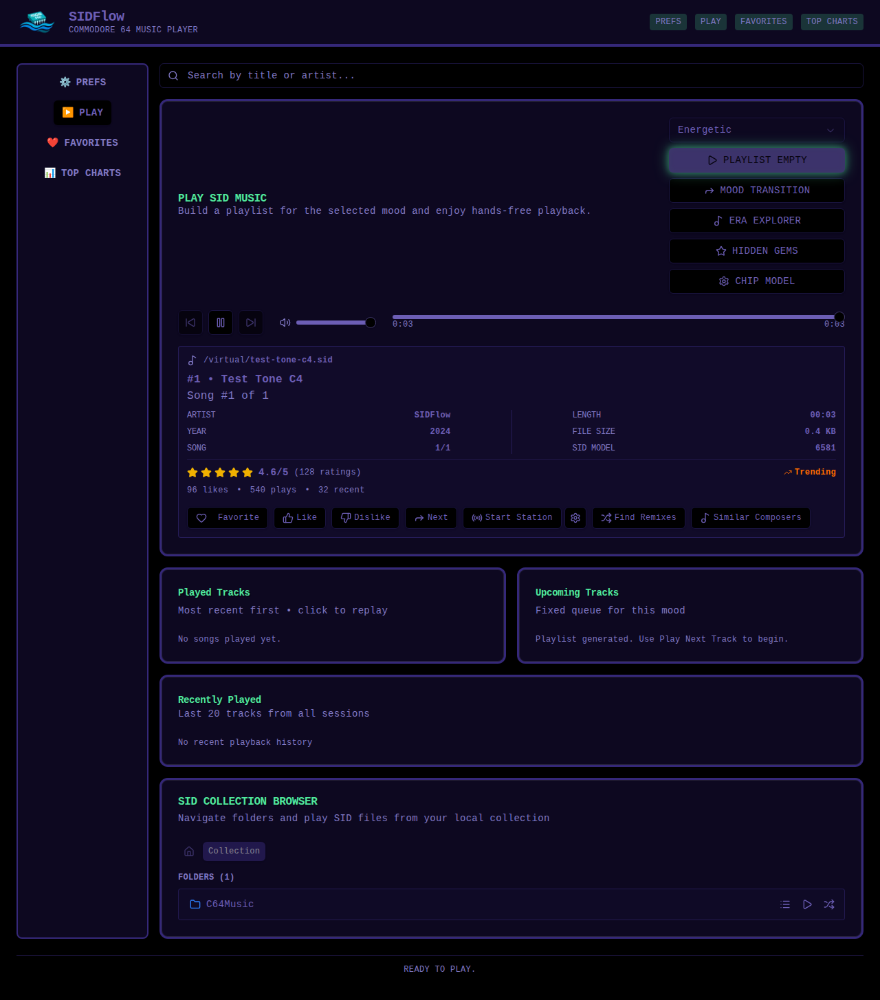
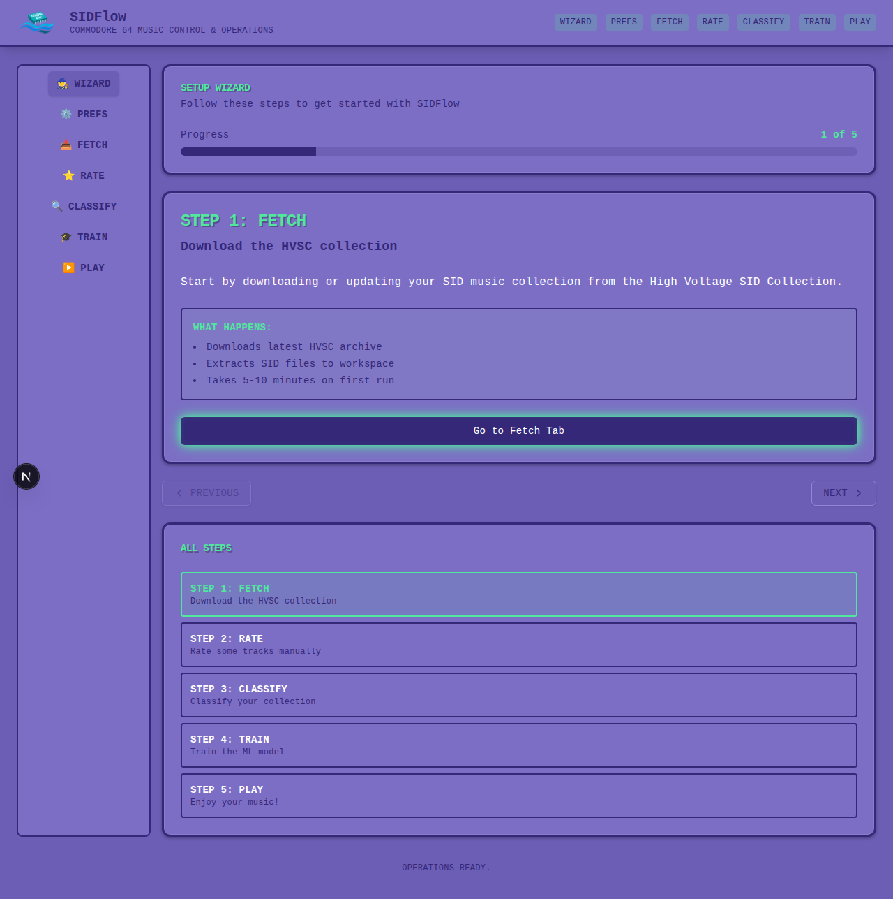
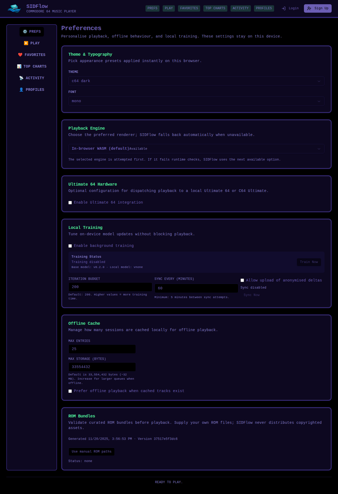
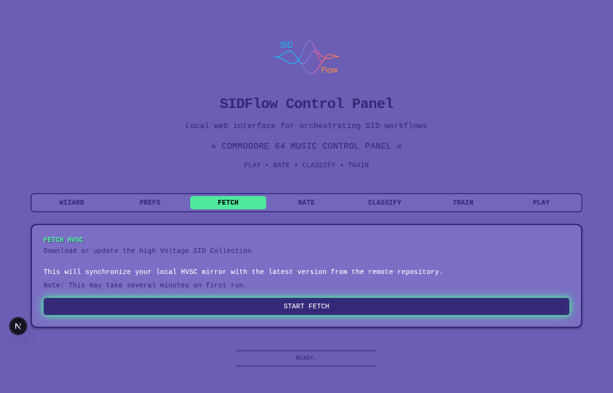
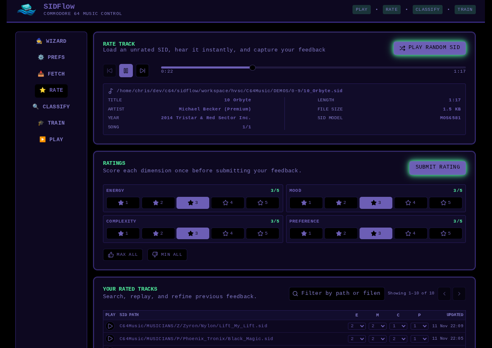
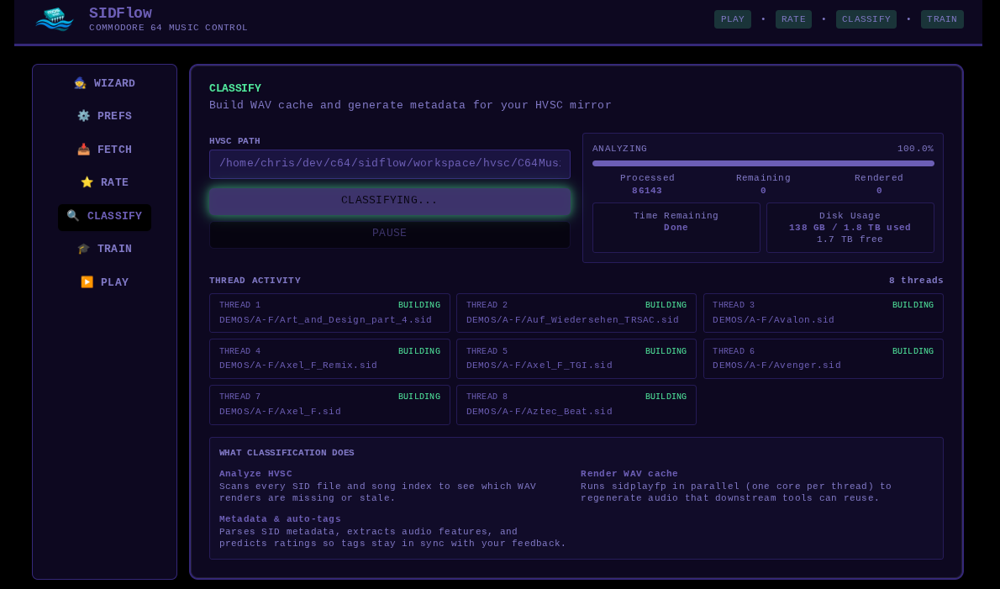
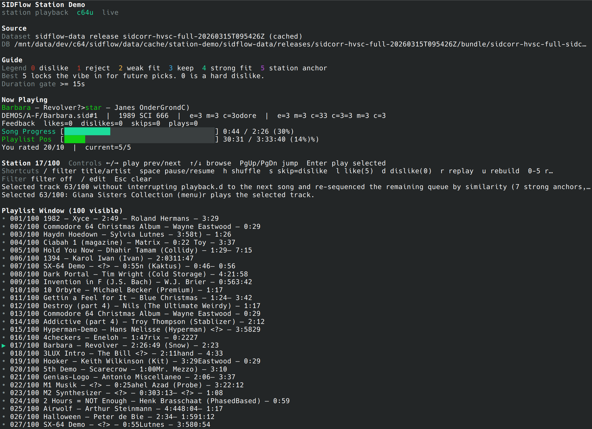

<!-- markdownlint-disable-next-line MD041 -->


# SIDFlow

A seamless stream of similar Commodore 64 SID songs.

[](https://github.com/chrisgleissner/sidflow/actions/workflows/ci.yaml)
[](https://codecov.io/github/chrisgleissner/sidflow)
[](https://www.gnu.org/licenses/old-licenses/gpl-2.0.en.html)
[](doc/developer.md)


SIDFlow analyses your Commodore 64 SID music collection. It extracts audio features, learns your taste, and generates a continuous stream of similar tracks.

> [!NOTE]
> This project is under active development. Some documented features may not yet be fully functional. 

## Quick Start

Three commands to a running local player:

**1. Install [Bun](https://bun.com/docs/installation)**

```sh
# macOS / Linux
curl -fsSL https://bun.com/install | bash

# Windows
powershell -c "irm bun.sh/install.ps1|iex"
```

**2. Clone and build**

```bash
git clone https://github.com/chrisgleissner/sidflow.git
cd sidflow
bun run build
```

**3. Start the web player**

```bash
cd packages/sidflow-web
bun run dev
```

Open **<http://localhost:3000>**.

The first-time setup wizard guides you through downloading HVSC and configuring your collection. Local dev mode defaults to `admin / password` for the admin console at **<http://localhost:3000/admin>**.

---

## Web UI

SIDFlow ships a **Next.js + React** interface with two access points:

| URL | Purpose |
|-----|---------|
| `http://localhost:3000` | Public player |
| `http://localhost:3000/admin` | Admin console |

### Public Player

Pick a mood preset and hit play. The queue fills automatically with similar tracks.



**Keyboard shortcuts (Play tab):** `Space` play/pause · `←/→` prev/next · `↑/↓` volume · `M` mute · `S` focus search · `?` help

**Favorites** are stored server-side (`data/.sidflow-preferences.json`) and shared across all browsers pointing at the same server.  
**Recently played** is stored per-browser in localStorage (up to 100 entries).

### Admin Console

The admin console (`/admin`) controls the full pipeline. Authenticate with `SIDFLOW_ADMIN_USER` / `SIDFLOW_ADMIN_PASSWORD` (defaults to `admin/password` in local dev only).

#### Wizard - first-time setup

Select your HVSC root and confirm cache locations.



#### Preferences

Tweak themes, fonts, render engines, ROM paths, and collection settings.



#### Fetch - download HVSC

Sync the High Voltage SID Collection from official mirrors.



#### Rate - tag your collection

Manually rate songs on energy, complexity, mood, and preference. Ratings feed into the training pipeline.



#### Classify - audio feature extraction

Automatically analyse your entire collection. Progress is displayed in real time.



For more details on routes and the REST API, see [packages/sidflow-web/README.md](packages/sidflow-web/README.md) and the [OpenAPI spec](packages/sidflow-web/openapi.yaml).

---

## How It Works

SIDFlow is a CLI-first pipeline. Each stage reads and writes JSONL under `data/` and is configured via `.sidflow.json`:

```
sidflow-fetch → sidflow-classify → sidflow-train → sidflow-play
     ↓                 ↓                 ↓               ↓
  HVSC sync      audio features      ML model       playlists
```

1. **Fetch** - downloads and synchronises HVSC (or any local SID collection).
2. **Classify** - renders each SID to WAV cache, extracts structural and audio features, and writes JSONL.
3. **Train** - consumes classified JSONL plus manual feedback to produce LanceDB model artifacts.
4. **Play** - uses similarity search against the model to generate context-aware queues.

The web UI, Docker image, and CLI tools are all thin wrappers over these same pipeline stages.

---

## CLI Tools

All pipeline stages are available as standalone CLIs for automation and scripting:

| CLI | Description |
|-----|-------------|
| **[sidflow-fetch](packages/sidflow-fetch/README.md)** | Sync HVSC from official mirrors |
| **[sidflow-classify](packages/sidflow-classify/README.md)** | Render WAV cache + extract features |
| **[sidflow-train](packages/sidflow-train/README.md)** | Train / update model artifacts |
| **[sidflow-rate](packages/sidflow-rate/README.md)** | Write manual rating/tag files |
| **[sidflow-play](packages/sidflow-play/README.md)** | Generate playlists via similarity search |

Full CLI reference: [Technical Reference](./doc/technical-reference.md).

### SID Station - command line radio

Launch a self-contained radio station in a Bash terminal that selects and streams similar SID tracks:



```bash
./scripts/sid-station.sh
```

For playback on a real Commodore 64 Ultimate over your LAN:

```bash
./scripts/sid-station.sh --c64u-host c64u
```

If `workspace/hvsc` is missing or empty, the script bootstraps HVSC automatically before starting.

---

## Config

`.sidflow.json` controls all runtime paths. The defaults work out of the box:

```json
{
  "sidPath": "./workspace/hvsc",
  "audioCachePath": "./workspace/audio-cache",
  "tagsPath": "./workspace/tags",
  "threads": 0,
  "classificationDepth": 3
}
```

Pass `--config /path/to/custom.json` to any CLI or set `SIDFLOW_CONFIG` for the web server to override the config location.

---

## Deployment

### Docker

Pre-built images: [`ghcr.io/chrisgleissner/sidflow:latest`](https://github.com/chrisgleissner/sidflow/pkgs/container/sidflow)

```bash
docker run -p 3000:3000 \
  -e SIDFLOW_ADMIN_USER=admin \
  -e SIDFLOW_ADMIN_PASSWORD='your-password' \
  -e SIDFLOW_ADMIN_SECRET='replace-with-a-32-character-secret-minimum' \
  -e JWT_SECRET='replace-with-a-32-character-secret-minimum' \
  -v /path/to/hvsc:/sidflow/workspace/hvsc \
  -v /path/to/audio-cache:/sidflow/workspace/audio-cache \
  -v /path/to/tags:/sidflow/workspace/tags \
  -v /path/to/data:/sidflow/data \
  ghcr.io/chrisgleissner/sidflow:latest
```

Web UI at **<http://localhost:3000>**, admin at `/admin`.

Production startup rejects default credentials, derived secrets, or a missing `JWT_SECRET`. Full Docker instructions, health checks, and smoke-testing are in [doc/deployment.md](doc/deployment.md).

### Fly.io

Fly deployment is supported as a single stateful machine:

```bash
curl -L https://fly.io/install.sh | sh          # install flyctl
./scripts/deploy/fly-deploy.sh -e stg            # staging
./scripts/deploy/fly-deploy.sh -e prd -t <tag>   # production
```

See [Deployment Guide](doc/deployment.md) for details.

---

## Portable Similarity Export

Produces a self-contained SQLite bundle containing per-track ratings, feedback aggregates, and 24-dimensional perceptual vectors (WAV + SID-native hybrid) for offline and downstream consumers.

Prerequisites: `bun` 1.3.1+, `ffmpeg`, `sidplayfp`, `curl`, `python3`, `gh` (authenticated).

**1. Reclassify the entire HVSC collection and generate the export:**

```bash
bash scripts/run-similarity-export.sh --mode local --full-rerun true
```

Output: `data/exports/sidcorr-hvsc-full-sidcorr-1.sqlite` and `sidcorr-hvsc-full-sidcorr-1.manifest.json`.

**2. Regenerate the export from existing classified data (skip reclassification):**

```bash
bun run export:similarity -- --profile full
```

**3. Publish the export as a release to `chrisgleissner/sidflow-data`:**

```bash
bash scripts/run-similarity-export.sh --workflow publish-only --mode local --publish-release true
```

Full schema and consumer workflow: [doc/similarity-export.md](doc/similarity-export.md).

### Classification Vector Reference

Each exported song also gets a 24-number similarity vector. It mixes what SIDFlow hears in the rendered WAV with what it reads from the SID chip write trace. The raw per-song feature dump is larger, but these 24 fields are the compact fingerprint used for similarity search and station building.

Sample record: [doc/examples/classification-vector-sample.json](doc/examples/classification-vector-sample.json)

| Internal name | Source | Meaning |
|---------------|--------|---------|
| `tempoFused` | Hybrid | Overall speed feel |
| `onsetDensityFused` | Hybrid | How often new notes or hits happen |
| `rhythmicRegularityFused` | Hybrid | How steady the rhythm feels |
| `syncopationSid` | SID | How much the beat pushes off the obvious pulse |
| `arpeggioRateSid` | SID | How much fast chord-cycling the tune uses |
| `waveTriangleRatio` | SID | Share of smooth triangle tone |
| `waveSawRatio` | SID | Share of buzzy saw tone |
| `wavePulseRatio` | SID | Share of hollow pulse tone |
| `waveNoiseRatio` | SID | Share of noisy/percussion-like tone |
| `pwmActivitySid` | SID | How much pulse-width modulation is moving |
| `filterCutoffMeanSid` | SID | Typical brightness of the SID filter |
| `filterMotionFused` | Hybrid | How much the tone color sweeps over time |
| `samplePlaybackRate` | SID | How much digi-sample playback is present |
| `melodicClarityFused` | Hybrid | How clearly a lead melody stands out |
| `bassPresenceFused` | Hybrid | How bass-heavy the tune feels |
| `accompanimentShareSid` | SID | How much of the arrangement acts as backing parts |
| `voiceRoleEntropySid` | SID | How evenly the SID voices split their jobs |
| `adsrPluckRatioSid` | SID | How often notes sound short and plucky |
| `adsrPadRatioSid` | SID | How often notes sound long and sustained |
| `loudnessFused` | Hybrid | Overall strength/loudness impression |
| `dynamicRangeWav` | WAV | Difference between softer and louder moments |
| `inharmonicityWav` | WAV | How rough or bell-like the spectrum is |
| `mfccResidual1` | Hybrid | Timbre detail left after obvious SID waveform patterns are removed |
| `mfccResidual2` | Hybrid | Another timbre detail channel for fine tonal differences |

`Source` means:

| Value | Meaning |
|-------|---------|
| `WAV` | Measured from the rendered audio |
| `SID` | Derived from SID register-write traces |
| `Hybrid` | SIDFlow combines WAV and SID evidence |

---

## Performance Tests

Journey-driven performance suite (k6 + optional Playwright):

```bash
# Run against a local server
bun run perf:run -- --env local --base-url http://localhost:3000 --results performance/results --tmp performance/tmp --execute
```

| Option | Notes |
|--------|-------|
| `--profile smoke\|reduced\|standard\|scale` | Defaults: local→smoke, CI→reduced |
| `--profile scale` | Hundreds-of-users load; remote-only guard |
| `--env remote --enable-remote` | Fly.io / Raspberry Pi targets |

Journeys live in `performance/journeys/`; outputs in `performance/results/<timestamp>/`. CI uses `--profile reduced` with k6-only for stability.

---

## Developer Documentation

- **[Technical Reference](doc/technical-reference.md)** - architecture, CLI tools, APIs
- **[Developer Guide](doc/developer.md)** - setup, testing, contributions

---

## Acknowledgements

SIDFlow is [GPLv2](LICENSE)-licensed and builds upon open-source software and datasets:

| Component | License | Source | Credit |
|-----------|---------|--------|--------|
| **Bun** | MIT | [github.com/oven-sh/bun](https://github.com/oven-sh/bun) | JS runtime and tooling |
| **libsidplayfp** | GPL v2+ | [github.com/libsidplayfp/libsidplayfp](https://github.com/libsidplayfp/libsidplayfp) | SID emulator compiled to WASM for browser playback |
| **High Voltage SID Collection (HVSC)** | Free for personal use | [hvsc.c64.org](https://www.hvsc.c64.org/) | Largest SID collection |
