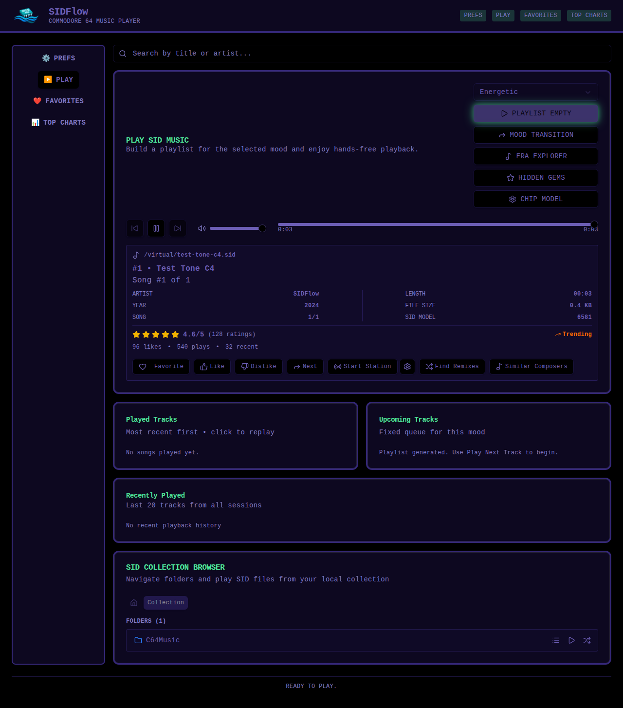
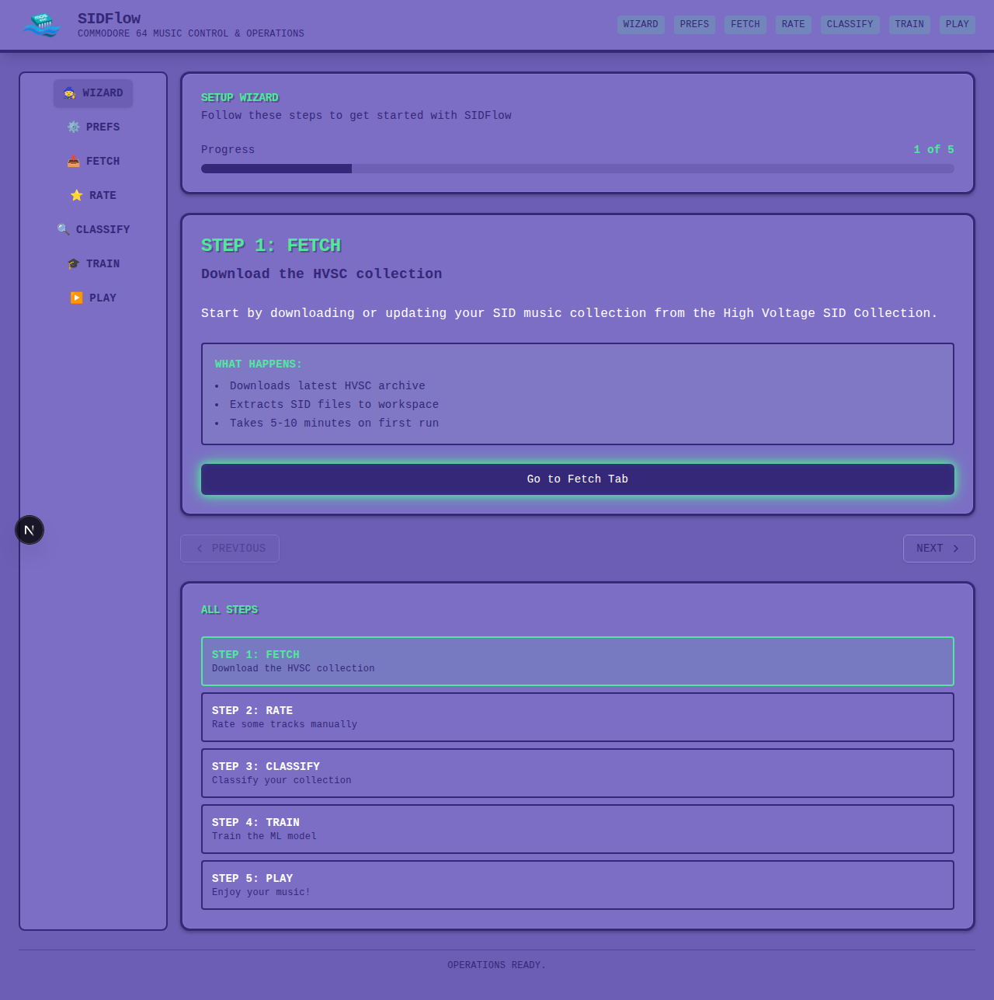
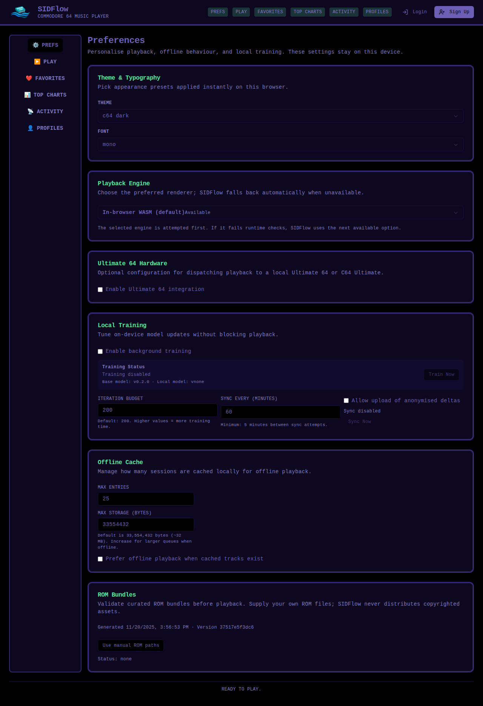
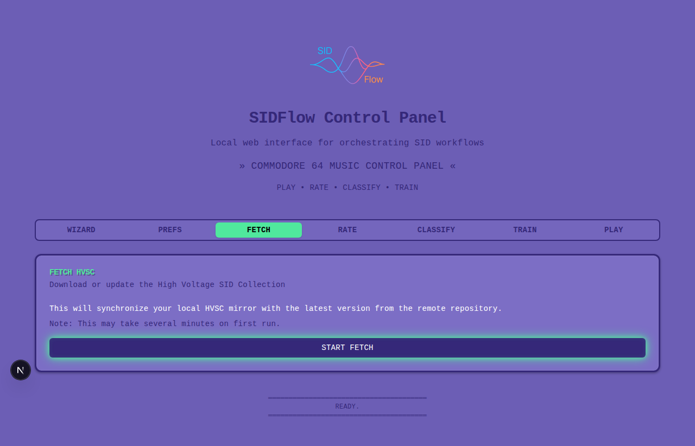
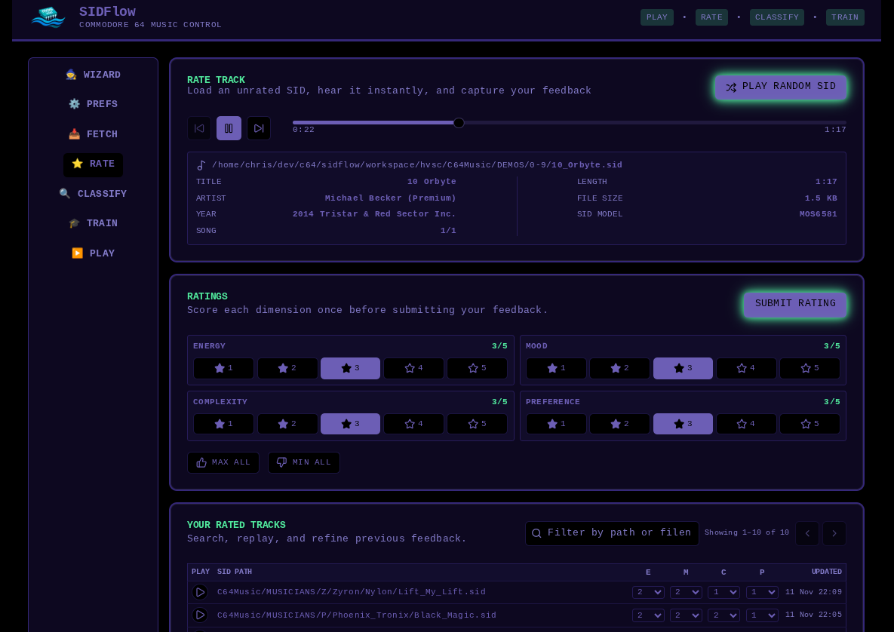
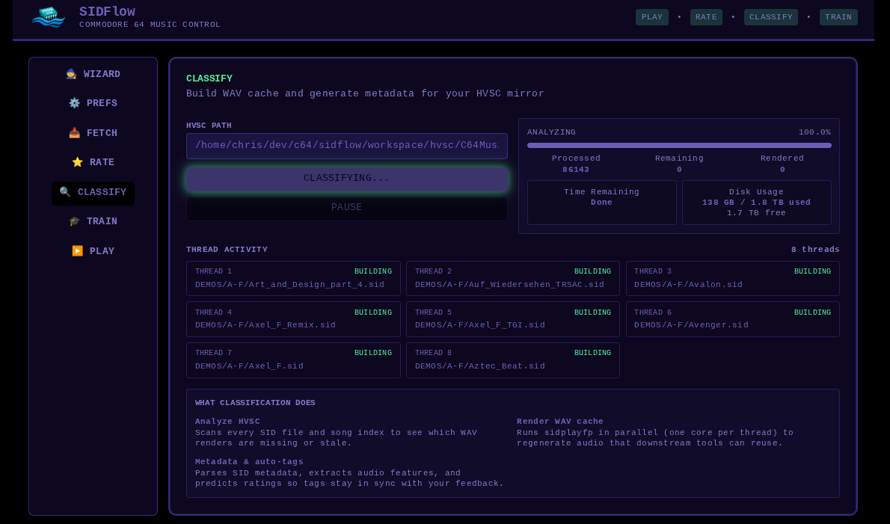
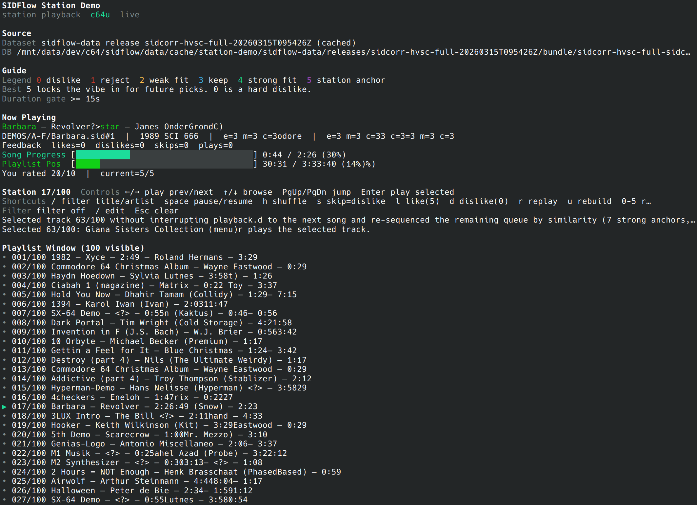

<!-- markdownlint-disable-next-line MD041 -->


# SIDFlow

A seamless stream of similar Commodore 64 SID songs.

[](https://github.com/chrisgleissner/sidflow/actions/workflows/ci.yaml)
[](https://codecov.io/github/chrisgleissner/sidflow)
[](https://www.gnu.org/licenses/old-licenses/gpl-2.0.en.html)
[](doc/developer.md)

SIDFlow analyses your Commodore 64 SID music collection. It extracts audio features, learns your taste, and generates a continuous stream of similar tracks.

## Choose your path

Start with the outcome you need; each path is independent at first and leads to the relevant detailed reference.

| I want to… | Start here | What SIDFlow provides |
|---|---|---|
| **Reuse the published HVSC analysis** in another project | [Download a verified release bundle](#reuse-published-hvsc-analysis-data) | Ready-made similarity data, manifests, checksums, and formal format specifications—no rendering or classification required. |
| **Classify my own SID collection** | [Understand the analysis pipeline](#analyse-and-publish-a-sid-collection) | Fetch, classification, ratings, similarity exports, and optional publication to `sidflow-data`. |
| **Listen to SID music** through a browser or terminal | [Run a player](#play-sid-music) | A local web player, a guided admin UI, and a terminal station with optional C64 Ultimate playback. |

If you need to run SIDFlow locally, continue with the installation below. Consumers of the published HVSC data can skip directly to the first path.

## Install and start SIDFlow

Three commands to a running local player:

**1. Install [Bun](https://bun.com/docs/installation)**

```sh
# macOS / Linux
curl -fsSL https://bun.com/install | bash

# Windows
powershell -c "irm bun.sh/install.ps1|iex"
```

**2. Clone and build**

```bash
git clone https://github.com/chrisgleissner/sidflow.git
cd sidflow
bun run build
```

**3. Start the web player**

```bash
cd packages/sidflow-web
bun run dev
```

Open **<http://localhost:3000>**.

The first-time setup wizard guides you through downloading HVSC and configuring your collection. Local dev mode defaults to `admin / password` for the admin console at **<http://localhost:3000/admin>**.

### System ROMs

Many SID songs require the Commodore 64 system ROM files in **`workspace/roms/`** at the repository root:

| File name (preferred) | ROM | Size |
|-----------------------|-----|------|
| `kernal.901227-03.bin` (or `kernal.bin`) | C64 Kernal | 8 KB |
| `basic.901226-01.bin` (or `basic.bin`) | C64 BASIC | 8 KB |
| `characters.901225-01.bin` (or `chargen.bin`) | Character generator | 4 KB |

The three files go **directly in the directory, not in subfolders**, and the sizes must be exact — 8192, 8192, and 4096 bytes. Either the preferred name or the short alias is recognised:

```
workspace/roms/
├── kernal.901227-03.bin      (or kernal.bin)
├── basic.901226-01.bin       (or basic.bin)
└── characters.901225-01.bin  (or chargen.bin)
```

**You normally do not have to do anything.** When classification starts and the ROMs are missing, SIDFlow downloads them from [VICE's C64 data directory](https://github.com/libretro/vice-libretro/tree/master/vice/data/C64) into the first search path below, and verifies each against a pinned SHA-256 before use — a ROM that is not the one we pinned is a different machine, so a mismatch is refused rather than accepted.

Fetch them up front, or into a specific directory:

```bash
bun run roms:fetch
bun run roms:fetch -- /path/to/roms
```

Set `SIDFLOW_ROMS_AUTO_FETCH=0` to disable the download and supply the files yourself. They are copyrighted Commodore code that SIDFlow does not vendor; you can equally dump them from a physical Commodore 64. The `workspace/roms/` directory is git-ignored so the ROM files are never committed.

Alternative locations (checked in order):
1. `$SIDFLOW_ROMS_DIR` or `$SIDFLOW_ROM_DIR` environment variable
2. `$SIDFLOW_ROOT/workspace/roms`
3. `workspace/roms/` ← **recommended default**
4. `public/roms/`

**What happens without them:** rendering does not fail loudly. libsidplayfp initialises a tune but never advances it, so affected songs come out as silence or a single held frame — and they still classify, producing plausible-looking features from audio that is wrong. If all three are not found, SIDFlow logs a warning and continues with built-in ROMs; treat that warning as a reason to stop, not a detail. Set `SIDFLOW_WASM_DISABLE_ROMS=1` only when you deliberately want ROM-free rendering.

---

## Reuse published HVSC analysis data

SIDFlow is the **tooling and runtime**: use it to analyse your own SID collection, build similarity exports, run a station, or integrate playback and recommendations into an application.

For ready-to-use analysis of the public High Voltage SID Collection (HVSC), download the release assets from **[sidflow-data](https://github.com/chrisgleissner/sidflow-data)**. That companion repository is the distribution point for checked manifests and checksums, so another project can consume SIDFlow's HVSC similarity results without first rendering and classifying the collection.

The [sidflow-data README](https://github.com/chrisgleissner/sidflow-data#readme) explains which published bundle to choose and how an external consumer should obtain and verify it. The formal formats are specified here:

- [full SQLite export](doc/similarity-export.md)
- [lite portable export](doc/similarity-export-lite.md)
- [tiny portable export](doc/similarity-export-tiny.md)

Choose a published flavour by runtime need; the companion repository remains the authoritative source for release-specific asset names, checksums, and download instructions.

**Start with lite.** It reproduces the full export's top-25 neighbours at R@25 = 0.987 and
its favourite-seeded stations at 98% overlap, in 8 MB against 982 MB. Full is for consumers
that specifically need `features_json` or SQL access.

| Flavour | Bytes | Use it when | Formal specification |
|---|---:|---|---|
| **Lite** (`sidcorr-lite-1`) | 8.1 MB | You want recommendations, stations and similarity. **The right default for almost every consumer.** | [Lite portable export](doc/similarity-export-lite.md) |
| **Tiny** (`sidcorr-tiny-1`) | 1.8 MB | You need the smallest deterministic bundle for a weak device: style filtering and neighbour expansion, intentionally lossy, and it carries no vectors. | [Tiny portable export](doc/similarity-export-tiny.md) |
| **Features sidecar** | 76 MB | You want to derive your own representation from the raw 129-key feature records. Supplementary, not a tier — pair it with lite. | [Full SQLite export](doc/similarity-export.md) |
| **Full** (`sidcorr-1`, SQLite) | 982 MB, or 194 MB gzipped | You need `features_json` in a database, or SQL-backed querying. | [Full SQLite export](doc/similarity-export.md) |

> Use this repository when you need to **generate, inspect, or serve** similarity data. Use [sidflow-data releases](https://github.com/chrisgleissner/sidflow-data/releases) when you need the **published HVSC results** in another project.

---

## Play SID music

### Web player and admin UI

SIDFlow ships a **Next.js + React** interface with two access points:

| URL | Purpose |
|-----|---------|
| `http://localhost:3000` | Public player |
| `http://localhost:3000/admin` | Admin console |

### Public Player

Pick a mood preset and hit play. The queue fills automatically with similar tracks.



**Keyboard shortcuts (Play tab):** `Space` play/pause · `←/→` prev/next · `↑/↓` volume · `M` mute · `S` focus search · `?` help

**Favorites** are stored server-side (`data/.sidflow-preferences.json`) and shared across all browsers pointing at the same server.  
**Recently played** is stored per-browser in localStorage (up to 100 entries).

### Admin Console

The admin console (`/admin`) controls the full pipeline. Authenticate with `SIDFLOW_ADMIN_USER` / `SIDFLOW_ADMIN_PASSWORD` (defaults to `admin/password` in local dev only).

#### Wizard - first-time setup

Select your HVSC root and confirm cache locations.



#### Preferences

Tweak themes, fonts, render engines, ROM paths, and collection settings.



#### Fetch - download HVSC

Sync the High Voltage SID Collection from official mirrors.



#### Rate - tag your collection

Manually rate songs on energy, complexity, mood, and preference. Ratings feed into the training pipeline.



#### Classify - audio feature extraction

Automatically analyse your entire collection. Progress is displayed in real time.



For more details on routes and the REST API, see [packages/sidflow-web/README.md](packages/sidflow-web/README.md) and the [OpenAPI spec](packages/sidflow-web/openapi.yaml).

---

## Analyse and publish a SID collection

### How the pipeline works

SIDFlow is a CLI-first pipeline. Each stage reads and writes JSONL under `data/` and is configured via `.sidflow.json`:

```
sidflow-fetch → sidflow-classify → sidflow-train → sidflow-play
     ↓                 ↓                 ↓               ↓
  HVSC sync      audio features      ML model       playlists
```

1. **Fetch** - downloads and synchronises HVSC (or any local SID collection).
2. **Classify** - renders each SID to WAV cache, extracts structural and audio features, and writes JSONL.
3. **Train** - consumes classified JSONL plus manual feedback to produce LanceDB model artifacts.
4. **Play** - uses similarity search against the model to generate context-aware queues.

The web UI, Docker image, and CLI tools are all thin wrappers over these same pipeline stages.

---

### CLI tools

All pipeline stages are available as standalone CLIs for automation and scripting:

| CLI | Description |
|-----|-------------|
| **[sidflow-fetch](packages/sidflow-fetch/README.md)** | Sync HVSC from official mirrors |
| **[sidflow-classify](packages/sidflow-classify/README.md)** | Render WAV cache + extract features |
| **[sidflow-train](packages/sidflow-train/README.md)** | Train / update model artifacts |
| **[sidflow-rate](packages/sidflow-rate/README.md)** | Write manual rating/tag files |
| **[sidflow-play](packages/sidflow-play/README.md)** | Generate playlists via similarity search |

Full CLI reference: [Technical Reference](./doc/technical-reference.md).

### SID Station — command-line radio

Launch a self-contained radio station in a Bash terminal that selects and streams similar SID tracks:



```bash
./scripts/sid-station.sh
```

For playback on a real Commodore 64 Ultimate over your LAN:

```bash
./scripts/sid-station.sh --c64u-host c64u
```

If `workspace/hvsc` is missing or empty, the script bootstraps HVSC automatically before starting.

---

### Configuration

`.sidflow.json` controls all runtime paths. The defaults work out of the box:

```json
{
  "sidPath": "./workspace/hvsc",
  "audioCachePath": "./workspace/audio-cache",
  "tagsPath": "./workspace/tags",
  "threads": 0,
  "classificationDepth": 3
}
```

Pass `--config /path/to/custom.json` to any CLI or set `SIDFLOW_CONFIG` for the web server to override the config location.

---

### Deploy SIDFlow (optional)

### Docker

Pre-built images: [`ghcr.io/chrisgleissner/sidflow:latest`](https://github.com/chrisgleissner/sidflow/pkgs/container/sidflow)

```bash
docker run -p 3000:3000 \
  -e SIDFLOW_ADMIN_USER=admin \
  -e SIDFLOW_ADMIN_PASSWORD='your-password' \
  -e SIDFLOW_ADMIN_SECRET='replace-with-a-32-character-secret-minimum' \
  -e JWT_SECRET='replace-with-a-32-character-secret-minimum' \
  -v /path/to/hvsc:/sidflow/workspace/hvsc \
  -v /path/to/audio-cache:/sidflow/workspace/audio-cache \
  -v /path/to/tags:/sidflow/workspace/tags \
  -v /path/to/data:/sidflow/data \
  ghcr.io/chrisgleissner/sidflow:latest
```

Web UI at **<http://localhost:3000>**, admin at `/admin`.

Production startup rejects default credentials, derived secrets, or a missing `JWT_SECRET`. Full Docker instructions, health checks, and smoke-testing are in [doc/deployment.md](doc/deployment.md).

---

### Build and publish portable similarity data

Produces a self-contained SQLite bundle containing per-track ratings, feedback aggregates, and 58-dimensional similarity vectors (WAV spectral + SID register-trace hybrid) for offline and downstream consumers.

Use this workflow when you need to create new data from a collection you control. If you only need the public HVSC results, use [published `sidflow-data` releases](#reuse-published-hvsc-analysis-data) instead.

Prerequisites: `bun` 1.3.1+, `ffmpeg`, `sidplayfp`, `curl`, `python3` (plus `gh` authenticated for step 3/publish). Many SID songs also require [C64 system ROMs](#system-roms) in `workspace/roms/`.

#### Regenerate and publish in one command

`run-similarity-export.sh` is the whole workflow, not just the classify step: it reclassifies the corpus, writes the full, lite, and tiny bundles with their manifests, and creates the `sidflow-data` release. To do all of that on a machine that has never seen this repository:

```bash
# Ubuntu/Debian prerequisites
sudo apt-get update && sudo apt-get install -y ffmpeg sidplayfp curl python3 git sqlite3
curl -fsSL https://bun.sh/install | bash && source ~/.bashrc

# Clone, fetch HVSC, reclassify everything, export all three formats, publish the release
git clone https://github.com/chrisgleissner/sidflow && cd sidflow \
  && bun install --frozen-lockfile \
  && ./scripts/sidflow-fetch \
  && bash scripts/run-similarity-export.sh --mode local --full-rerun true --publish-release true
```

Drop `--publish-release true` to stop after the export and inspect the bundles before releasing anything. Add `--max-songs 200` for a quick end-to-end rehearsal against a corpus subset.

Before you start:

- **Copy [C64 system ROMs](#system-roms) into `workspace/roms/` first.** They are git-ignored, so a fresh clone never has them, and many tunes need them to render correctly.
- **`--publish-release true` needs `gh auth login`** with permission to create releases on `chrisgleissner/sidflow-data`. The script checks this before classifying, so it fails fast rather than after a long run.
- **Use `--mode local`, not `--mode docker`, unless you know the image is current.** Docker mode pulls `ghcr.io/chrisgleissner/sidflow:latest`, which bakes in whichever `libsidplayfp-wasm` version was installed at image build time. If that image predates an engine fix, the run will happily regenerate data with the old engine. Local mode uses the version in your lockfile.
- **Classification runs under Bun, not Node.** `@sidflow/common` re-exports three SQLite-backed modules that import `bun:sqlite`, and Node's ESM loader rejects the `bun:` scheme, so every classify module that imports the package barrel is unloadable under Node. `--runtime node` therefore fails immediately with `ERR_UNSUPPORTED_ESM_URL_SCHEME`. Bun is already a prerequisite and the export step always ran under it.

**0. Download HVSC:**

Download the latest High Voltage SID Collection:

```bash
./scripts/sidflow-fetch
```

This downloads the latest HVSC base archive plus any delta archives from `https://hvsc.brona.dk/HVSC/` and extracts them into `workspace/hvsc/` (i.e. the `sidPath` configured in `.sidflow.json`). The extracted SID files will be under `workspace/hvsc/C64Music/`. 

If you already have a local HVSC copy elsewhere, point `sidPath` in `.sidflow.json` at that directory instead and skip this step.

**1. Reclassify the entire HVSC collection and generate the export:**

Classifying all 61,787 SID files of HVSC 85, which declare 87,868 songs. **Every song is classified**, including very short ones.

### Which part of a tune is analysed

The first seconds of a tune are its least characteristic part — a fade-in, a bare bass line, a title jingle — so analysis skips them. A *fixed* skip is wrong for short tunes, and HVSC is full of them: with a flat 15-second skip, 16,398 of 87,868 songs (18.66%) were described by a window that opened after the music had already stopped, leaving 34 of the 58 similarity dimensions at a shared default. The skip therefore scales with the tune:

| Song length | Skipped | Analysed |
|---|---|---|
| 10s or less | 0s | the whole tune |
| 20s | 7.5s | 12.5s |
| 30s or more | 15s | 15s |

Linear between 10s and 30s, so a one-second difference in length cannot produce a wholly different description of the same tune. The same window is applied to both the rendered audio and the SID register trace, so the two halves of the vector always describe the same interval.

Very short songs are analysed rather than dropped, so the corpus matches the collection and nothing goes missing without explanation. They are, however, measured over fewer frames, and fifteen of the dimensions describe rates, regularities and entropies over frames. **`sidTraceFrameCount` reports how many frames each track was measured over**, so a consumer that wants to exclude thin evidence — or quiet tracks, using `rms` — has the numbers to do it.

> **Timings depend on the engine and the thread count.** The log below is a SIDLite run, which is the default; `SIDFLOW_SID_ENGINE=residfp` renders roughly 7x slower and rendering dominates, so budget most of a day for a reference-fidelity pass. Measure your own hardware with `--max-songs 200` before committing either way.

> **Classification runs in chunks and restarts the stack between them.** A long-lived run exhausts memory at a predictable point — measured repeatedly at ~3.5 GiB RSS after roughly 88,000 WASM instantiations — and dies with `RangeError: Out of memory`. Rather than waiting for that and resuming, the workflow classifies `--chunk-songs` songs at a time (default 1000) and tears the whole local stack down between chunks. Measured across 19 consecutive chunks: peak RSS held constant at 1,632 MiB with zero failures. A continuous memory trace is written to `tmp/runtime/similarity-export/memory-samples.jsonl`, and any chunk that does fail leaves a full report under `logs/crash-reports/` rather than a truncated log line. Pass `--chunk-songs 0` for one long-lived run.

> **Thread count barely affects throughput; it affects memory.** Measured on real 1,000-song chunks: 6 threads 9.52 songs/s, 8 threads 9.52, 10 threads 9.43, 14 threads 9.90 — a 5% spread. A short 710-track benchmark had suggested 12 threads was 22% faster (12.26 against 10.01 tracks/s), but that does not reproduce on a full corpus: per-thread throughput falls as threads rise while the total stays flat, so something shared is saturated and extra threads only add concurrent WASM instances. Since speed is flat, memory decides — at `--threads 12` a 5,000-song chunk reached the memory limit at 99%, while at `--threads 6` it completes comfortably. The default is **6**.

```bash
bash scripts/run-similarity-export.sh --mode local --full-rerun true --threads 6
```

Expected logs:
```
11:25 $ bash scripts/run-similarity-export.sh --mode local --full-rerun true
[sidcorr] Mode is full rerun: existing classified data and export artifacts will be ignored and replaced
[sidcorr] Full rerun: removing prior classified JSONL artifacts from /home/chris/dev/c64/sidflow/data/classified
[sidcorr] Mode: local
[sidcorr] Runtime: bun
[sidcorr] Installing dependencies for Bun local mode
[sidcorr] Starting local web server under Bun on port 3000
[sidcorr] Triggering classification with payload {"async":false,"skipAlreadyClassified":false,"deleteWavAfterClassification":true,"forceRebuild":true}
[sidcorr] Classification request started
[sidcorr] Waiting for classification to finish
[sidcorr] progress update: completed=150 remaining=86924 total=87074 elapsed=20s eta=3h 15m 5s rate=7.43 songs/s percent=0.2 phase=tagging phases[analyzing=done, metadata=done, building=done, tagging=now, finalizing=todo, completed=todo] stageCounts[rendered=153, extracted=150, tagged=150] featureHealth[completeRealistic=150/150 (100.0%)]
[sidcorr] progress update: completed=2200 remaining=84874 total=87074 elapsed=50s eta=32m 19s rate=43.78 songs/s percent=2.5 phase=tagging phases[analyzing=done, metadata=done, building=done, tagging=now, finalizing=todo, completed=todo] stageCounts[rendered=2202, extracted=2200, tagged=2200] featureHealth[completeRealistic=2200/2200 (100.0%)]
[sidcorr] progress update: completed=4150 remaining=82924 total=87074 elapsed=1m 20s eta=26m 45s rate=51.67 songs/s percent=4.8 phase=tagging phases[analyzing=done, metadata=done, building=done, tagging=now, finalizing=todo, completed=todo] stageCounts[rendered=4153, extracted=4150, tagged=4150] featureHealth[completeRealistic=4150/4150 (100.0%)]
[sidcorr] progress update: completed=5600 remaining=81474 total=87074 elapsed=1m 50s eta=26m 46s rate=50.74 songs/s percent=6.4 phase=tagging phases[analyzing=done, metadata=done, building=done, tagging=now, finalizing=todo, completed=todo] stageCounts[rendered=5602, extracted=5600, tagged=5600] featureHealth[completeRealistic=5600/5600 (100.0%)]

...snip...

[sidcorr] progress update: completed=87074 remaining=0 total=87074 elapsed=26m 28s eta=0s rate=54.84 songs/s percent=100.0 phase=finalizing phases[analyzing=done, metadata=done, building=done, tagging=done, finalizing=now, completed=todo] stageCounts[rendered=87073, extracted=87073, tagged=87074] featureHealth[completeRealistic=87066/87074 (100.0%)]
[sidcorr] progress update: completed=87074 remaining=0 total=87074 elapsed=27m 58s eta=0s rate=51.89 songs/s phase=completed phases[analyzing=done, metadata=done, building=done, tagging=done, finalizing=done, completed=done] stageCounts[rendered=87074, extracted=0, tagged=87074] featureHealth[completeRealistic=0/0 (unknown)]
[sidcorr] Classification completed
[sidcorr] Running local export with bun runtime
$ bun run packages/sidflow-play/src/cli.ts export-similarity --profile full --neighbors 25 --corpus-version hvsc
Building similarity export from data/classified
Writing SQLite bundle to data/exports/sidcorr-hvsc-full-sidcorr-1.sqlite
Export complete in 1488643ms
Tracks: 87073
Manifest: data/exports/sidcorr-hvsc-full-sidcorr-1.manifest.json
[sidcorr] Export complete
[sidcorr] Export runtime: bun
[sidcorr] SQLite: /home/chris/dev/c64/sidflow/data/exports/sidcorr-hvsc-full-sidcorr-1.sqlite
[sidcorr] Manifest: /home/chris/dev/c64/sidflow/data/exports/sidcorr-hvsc-full-sidcorr-1.manifest.json
```

Output: `data/exports/sidcorr-hvsc-full-sidcorr-1.sqlite`, `sidcorr-hvsc-full-sidcorr-1.manifest.json`, `data/exports/sidcorr-hvsc-full-sidcorr-lite-1.sidcorr`, `data/exports/sidcorr-hvsc-full-sidcorr-lite-1.manifest.json`, `data/exports/sidcorr-hvsc-full-sidcorr-tiny-1.sidcorr`, and `data/exports/sidcorr-hvsc-full-sidcorr-tiny-1.manifest.json`.

**1a. Choose the SID emulation (optional):**

Classification renders with **SIDLite** by default, and that default is measured rather than assumed. A pre-registered paired comparison on **23,817 identical tracks** ([doc/sid-engine-comparison.md](doc/sid-engine-comparison.md)) found:

| Endpoint | reSIDfp | SIDLite | Relative | Holm p |
|---|---|---|---|---|
| nDCG@10, 24 WAV-derived dimensions | 0.3221 | 0.3173 | +1.49% | 0.0848 |
| nDCG@10, full 58-dimension vector | 0.5442 | 0.5421 | +0.40% | 0.1224 |
| Cold-start nDCG@10, 24 dimensions | 0.0615 | 0.0766 | **−19.71%** | — |
| Rating agreement, quadratic-weighted κ | — | — | 0.82–0.89 | — |

reSIDfp is very slightly better in the WAV-derived subspace — the only place an audio model can act — but the effect fails multiplicity correction, reverses on cold start, and shrinks to +0.40% in the vector that ships, because 34 of the 58 dimensions read the SID register write trace and are identical under both engines by construction. Against roughly 7x the wall clock, it does not pay.

`reSIDfp` remains the cycle-accurate reference. Choose it for audio fidelity — listening, A/B work, anything where you want the reference rendering itself. For *classification*, the measurement above is the reason not to.

```bash
# Default — fast, good enough to classify from
bash scripts/run-similarity-export.sh --mode local --full-rerun true

# Reference fidelity instead, roughly 10x slower
SIDFLOW_SID_ENGINE=residfp bash scripts/run-similarity-export.sh --mode local --full-rerun true
```

The classify CLI takes the same choice as a flag:

```bash
./scripts/sidflow-classify --sid-engine residfp
```

Precedence is `--sid-engine`, then `SIDFLOW_SID_ENGINE`, then the SIDLite default.

| Engine | Speed | DC offset (Commando) | Use for |
|--------|-------|----------------------|---------|
| `sidlite` (default) | ~30-40x realtime | 0.10 | Everyday use, and classifying a corpus |
| `residfp` | ~2-6x realtime | 0.003 | Cycle-accurate reference, A/B comparison |

Do not mix engines within one corpus. Features are derived from the rendered audio, so tracks rendered by different emulations are not comparable, and cosine over a mixture measures the emulation as much as the music. **The export now refuses a mixed corpus** rather than producing one quietly: every classified record carries a `sid_engine` field, and `buildSimilarityExport` fails if more than one value appears.

Which engine to use for a corpus you intend to publish is a measurement question, not a taste one, and it is answered in [doc/sid-engine-comparison.md](doc/sid-engine-comparison.md) — a pre-registered paired comparison of the two engines on identical tracks.

**1b. Verify the run used the engine you think it did:**

Getting a *different* engine than you asked for is the failure mode this pipeline has actually suffered — and the damage was not the emulation but a broken build of it, which loaded, rendered, and returned plausible sample counts while producing materially wrong audio. All three checks below are cheap, and all three are worth running before you publish anything.

```bash
# Each artifact must contain its own builder and not the other one.
grep -ac WasmSIDLite  node_modules/libsidplayfp-wasm/dist/sidlite/libsidplayfp.wasm  # expect > 0
grep -ac WasmReSIDfp  node_modules/libsidplayfp-wasm/dist/libsidplayfp.wasm          # expect > 0

# Which SID emulation actually rendered the corpus.
jq -r '.sid_engine' data/exports/sidcorr-hvsc-full-sidcorr-1.manifest.json

# Which renderer backend was used. Note this is NOT the emulation: it reports "wasm"
# for both sidlite and residfp, because both run inside the WASM renderer. Use the
# manifest field above to tell them apart.
sqlite3 data/exports/sidcorr-hvsc-full-sidcorr-1.sqlite \
  'select render_engine, count(*) from tracks group by 1'
```

These are enforced automatically too:

- `test/engine-health.test.ts` runs the same signal checks against **both** engines — audible, unclipped, DC-bounded, multi-SID, repeatable. It is what would have caught the broken artifact.
- The engine's own repository ([libsidplayfp-wasm](https://github.com/chrisgleissner/libsidplayfp-wasm)) qualifies each release against a native libsidplayfp built from the same pinned refs, so the package installed here has already been proved to agree with the reference implementation.

**1c. Convert the full export into lite or tiny bundles explicitly (optional):**

```bash
./scripts/sidflow-play export-similarity \
  --format lite \
  --source-sqlite data/exports/sidcorr-hvsc-full-sidcorr-1.sqlite \
  --output data/exports/sidcorr-hvsc-full-sidcorr-lite-1.sidcorr

./scripts/sidflow-play export-similarity \
  --format tiny \
  --source-sqlite data/exports/sidcorr-hvsc-full-sidcorr-1.sqlite \
  --output data/exports/sidcorr-hvsc-full-sidcorr-tiny-1.sidcorr
```

Portable bundle filenames should always carry the schema ID directly in the basename. Optional gzip-compressed transport variants append `.gz` without changing the basename, for example `sidcorr-hvsc-full-sidcorr-lite-1.sidcorr.gz`.

The station runtime accepts all three local formats through the same CLI path:

```bash
./scripts/sid-station.sh \
  --local-db data/exports/sidcorr-hvsc-full-sidcorr-1.sqlite \
  --similarity-format sqlite

./scripts/sid-station.sh \
  --local-db data/exports/sidcorr-hvsc-full-sidcorr-lite-1.sidcorr \
  --similarity-format lite

./scripts/sid-station.sh \
  --local-db data/exports/sidcorr-hvsc-full-sidcorr-tiny-1.sidcorr \
  --similarity-format tiny
```

`--similarity-format auto` remains the default and infers the format from the selected local bundle path.

**2. Regenerate the export from existing classified data (skip reclassification):**

```bash
bun run export:similarity -- --profile full
```

**3. Publish the export as release assets to `chrisgleissner/sidflow-data`:**

The following command requires permissions to create new releases on `chrisgleissner/sidflow-data` and is only intended for the repo maintainers:

```bash
bash scripts/run-similarity-export.sh --workflow publish-only --mode local --publish-release true
```

This uploads the sqlite export, sqlite manifest, lite bundle, lite manifest, tiny bundle, tiny manifest, `SHA256SUMS`, and a `.tar.gz` bundle containing those same files — that is, all three formats in one release.

Use `--workflow publish-only` when the export already exists and you only want to release it. If you are regenerating anyway, pass `--publish-release true` to the full run instead and skip this step; both paths produce an identical release.

The release is tagged `sidcorr-<corpus>-<profile>-<UTC timestamp>`, for example `sidcorr-hvsc-full-20260407T115218Z`. Pass `--publish-timestamp YYYYMMDDTHHMMSSZ` to pin it. Publishing refuses to overwrite an existing tag, so a re-run needs a new timestamp.

Full schema and consumer workflow: [doc/similarity-export.md](doc/similarity-export.md).

#### Classification vector reference

Each exported song also gets a **58-number** similarity vector — the compact fingerprint used for similarity search and station building. It has three parts:

| Part | Count | Read from | Documented in |
|---|---|---|---|
| Perceptual | 24 | The rendered WAV, plus SID register-state summaries | The table below |
| Tonal | 11 | Note-level analysis of the SID register write trace | [station-quality.md](doc/station-quality.md) |
| Playroutine and driver shape | 23 | How the driver code drives the chip | [station-quality.md](doc/station-quality.md) |

The 34 trace-derived dimensions were added after measurement showed the 24 perceptual
ones had stopped improving: on a held-out, composer-grouped split they take retrieval
from nDCG@10 0.2340 to 0.5392. Only the 24 below depend on the SID emulation; the other
34 read the register write trace, which the audio model never touches.

Sample record: [doc/examples/classification-vector-sample.json](doc/examples/classification-vector-sample.json)

| Internal name | Source | Meaning |
|---------------|--------|---------|
| `tempoFused` | Hybrid | Overall speed feel |
| `onsetDensityFused` | Hybrid | How often new notes or hits happen |
| `rhythmicRegularityFused` | Hybrid | How steady the rhythm feels |
| `syncopationSid` | SID | How much the beat pushes off the obvious pulse |
| `arpeggioRateSid` | SID | How much fast chord-cycling the tune uses |
| `waveTriangleRatio` | SID | Share of smooth triangle tone |
| `waveSawRatio` | SID | Share of buzzy saw tone |
| `wavePulseRatio` | SID | Share of hollow pulse tone |
| `waveNoiseRatio` | SID | Share of noisy/percussion-like tone |
| `pwmActivitySid` | SID | How much pulse-width modulation is moving |
| `filterCutoffMeanSid` | SID | Typical brightness of the SID filter |
| `filterMotionFused` | Hybrid | How much the tone color sweeps over time |
| `samplePlaybackRate` | SID | How much digi-sample playback is present |
| `melodicClarityFused` | Hybrid | How clearly a lead melody stands out |
| `bassPresenceFused` | Hybrid | How bass-heavy the tune feels |
| `accompanimentShareSid` | SID | How much of the arrangement acts as backing parts |
| `voiceRoleEntropySid` | SID | How evenly the SID voices split their jobs |
| `adsrPluckRatioSid` | SID | How often notes sound short and plucky |
| `adsrPadRatioSid` | SID | How often notes sound long and sustained |
| `loudnessFused` | Hybrid | Overall strength/loudness impression |
| `dynamicRangeWav` | WAV | Difference between softer and louder moments |
| `inharmonicityWav` | WAV | How rough or bell-like the spectrum is |
| `mfccResidual1` | Hybrid | Timbre detail left after obvious SID waveform patterns are removed |
| `mfccResidual2` | Hybrid | Another timbre detail channel for fine tonal differences |

`Source` means:

| Value | Meaning |
|-------|---------|
| `WAV` | Measured from the rendered audio |
| `SID` | Derived from SID register-write traces |
| `Hybrid` | SIDFlow combines WAV and SID evidence |

---

## Operate and validate SIDFlow

### Performance tests

Journey-driven performance suite (k6 + optional Playwright):

```bash
# Run against a local server
bun run perf:run -- --env local --base-url http://localhost:3000 --results performance/results --tmp performance/tmp --execute
```

| Option | Notes |
|--------|-------|
| `--profile smoke\|reduced\|standard\|scale` | Defaults: local→smoke, CI→reduced |
| `--profile scale` | Hundreds-of-users load; remote-only guard |
| `--env remote --enable-remote` | Explicitly enabled remote targets |

Journeys live in `performance/journeys/`; outputs in `performance/results/<timestamp>/`. CI uses `--profile reduced` with k6-only for stability.

---

## Developer documentation

- **[DeepWiki](https://deepwiki.com/chrisgleissner/sidflow)** - architecture and design
- **[Technical Reference](doc/technical-reference.md)** - architecture, CLI tools, APIs
- **[Developer Guide](doc/developer.md)** - setup, testing, contributions

---

## Acknowledgements

SIDFlow is [GPLv2](LICENSE)-licensed and builds upon open-source software and datasets:

| Component | License | Source | Credit |
|-----------|---------|--------|--------|
| **Bun** | MIT | [github.com/oven-sh/bun](https://github.com/oven-sh/bun) | JS runtime and tooling |
| **libsidplayfp** | GPL v2+ | [github.com/libsidplayfp/libsidplayfp](https://github.com/libsidplayfp/libsidplayfp) | SID emulator compiled to WASM for browser playback |
| **High Voltage SID Collection (HVSC)** | Free for personal use | [hvsc.c64.org](https://www.hvsc.c64.org/) | Largest SID collection |
