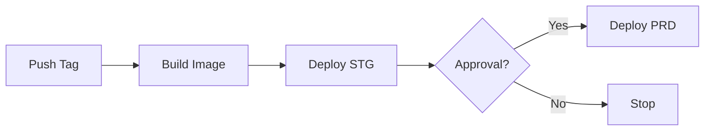

# Deployment Guide

This guide covers running SIDFlow in production with Docker, reproducing the release flow locally, and running the CLI tools from inside the container.

## Standard Docker Scenario (Recommended)

Basic deployment (good for development/testing):

```bash
docker run -p 3000:3000 \
  -e SIDFLOW_ADMIN_USER=admin \
  -e SIDFLOW_ADMIN_PASSWORD='change-me' \
  -v /path/to/hvsc:/sidflow/workspace/hvsc \
  -v /path/to/wav-cache:/sidflow/workspace/wav-cache \
  -v /path/to/tags:/sidflow/workspace/tags \
  -v /path/to/data:/sidflow/data \
  ghcr.io/chrisgleissner/sidflow:latest
```

**Security-Hardened Deployment (recommended for production):**

```bash
docker run -p 3000:3000 \
  -e SIDFLOW_ADMIN_USER=admin \
  -e SIDFLOW_ADMIN_PASSWORD='change-me' \
  --cap-drop=ALL \
  --cap-add=CHOWN,SETUID,SETGID,NET_BIND_SERVICE \
  --read-only \
  --tmpfs /tmp:rw,noexec,nosuid,size=100m \
  --security-opt=no-new-privileges:true \
  --user 1000:1000 \
  -v /path/to/hvsc:/sidflow/workspace/hvsc:ro \
  -v /path/to/wav-cache:/sidflow/workspace/wav-cache \
  -v /path/to/tags:/sidflow/workspace/tags \
  -v /path/to/data:/sidflow/data \
  ghcr.io/chrisgleissner/sidflow:latest
```

**Security Features:**

- ✅ Non-root runtime (UID/GID 1000, standard node user)
- ✅ SHA256-verified Bun downloads
- ✅ Pinned base image (`node:22-slim@sha256:...`)
- ✅ SUID/SGID bits stripped from all binaries
- ✅ Minimal package set (~650MB, removed Playwright libs)
- ✅ tini init for proper signal handling
- ✅ Restrictive file permissions (packages/scripts read-only)
- ✅ Startup script validates mount ownership
- ✅ Built-in health check (`/api/health`)

**Security Flags Explained:**

- `--cap-drop=ALL --cap-add=...`: Drop all Linux capabilities, add only required ones
- `--read-only`: Make root filesystem read-only (requires `--tmpfs /tmp`)
- `--tmpfs /tmp`: Writable temporary space with noexec/nosuid
- `--security-opt=no-new-privileges`: Prevent privilege escalation
- `--user 1000:1000`: Run as non-root node user (standard from base image)
- Mount HVSC as `:ro` (read-only) since it's never written to

**Key Information:**

- Web UI: <http://localhost:3000> (admin at `/admin`)
- Default config: `/sidflow/.sidflow.json`
- Non-root runtime, built-in Docker `HEALTHCHECK` hitting `/api/health`

## Reproduce Release Flow Locally (Build + Smoke Test)

Run the same build/smoke sequence used in CI:

```bash
npm run docker:smoke
# Optional overrides:
# IMAGE_TAG=sidflow:test PORT=4000 npm run docker:smoke
```

What it does:

- Builds `Dockerfile.production` and tags the image (`IMAGE_TAG`, default `sidflow:local`)
- Runs a container with admin creds, waits for Docker health to turn `healthy`
- Calls `/api/health` and shows the response
- Cleans up the container automatically

Prereqs: Docker daemon available; no HVSC volumes required for the smoke test.

## Images & Tags

- GHCR: `ghcr.io/chrisgleissner/sidflow:<version>` and `:latest`
- Multi-platform: `linux/amd64`, `linux/arm64`
- Production Dockerfile: `Dockerfile.production`

## Volumes and Paths

| Host path               | Container path                 | Purpose                          |
| ----------------------- | ------------------------------ | -------------------------------- |
| `/path/to/hvsc`         | `/sidflow/workspace/hvsc`      | HVSC mirror                      |
| `/path/to/wav-cache`    | `/sidflow/workspace/wav-cache` | Rendered WAV cache               |
| `/path/to/tags`         | `/sidflow/workspace/tags`      | Rating/tag files                 |
| `/path/to/data`         | `/sidflow/data`                | Classified data, availability    |

`SIDFLOW_ROOT` defaults to `/sidflow`, so the CLI and web server share the same config and data.

## Environment

Common variables:

- `SIDFLOW_ADMIN_USER` / `SIDFLOW_ADMIN_PASSWORD` (required)
- `HOST` (default `0.0.0.0`), `PORT` (default `3000`)
- `SIDFLOW_ROOT` (default `/sidflow`)
- `SIDFLOW_CONFIG` (custom config path if needed)

## CLI Usage Inside the Container

CLIs are available with Bun and native tools (ffmpeg, sidplayfp):

```bash
# Fetch HVSC
docker run --rm -w /sidflow \
  -v /path/to/hvsc:/sidflow/workspace/hvsc \
  -v /path/to/data:/sidflow/data \
  ghcr.io/chrisgleissner/sidflow:latest \
  bun ./scripts/sidflow-fetch --config /sidflow/.sidflow.json

# Classify collection
docker run --rm -w /sidflow \
  -v /path/to/hvsc:/sidflow/workspace/hvsc \
  -v /path/to/wav-cache:/sidflow/workspace/wav-cache \
  -v /path/to/data:/sidflow/data \
  ghcr.io/chrisgleissner/sidflow:latest \
  bun ./scripts/sidflow-classify --config /sidflow/.sidflow.json
```

Use `docker exec -w /sidflow <container>` for long-running containers.

## Health Checks & Troubleshooting

- Check status: `docker inspect --format='{{.State.Health.Status}}' <container>`
- Logs: `docker logs <container>`
- Manual health: `curl http://localhost:3000/api/health`
- If health is `unhealthy`, inspect container logs for stack traces or missing config/volumes.

## Release Zip (Alternative)

Each GitHub release publishes `sidflow-<version>.zip` containing the workspace and standalone server. Use `./scripts/start-release-server.sh` from the extracted directory when not using Docker.

## Raspberry Pi Production Deployment

This section covers deploying SIDFlow on a Raspberry Pi with Docker Compose, designed for lightweight, resilient, and secure production use. Ideal for home LAN access via Cloudflare Tunnel.

### Prerequisites

- Raspberry Pi 3B+ or newer (Pi 4 with 2GB+ RAM recommended)
- Raspberry Pi OS (64-bit) or any ARM64 Linux distribution
- Docker and Docker Compose installed
- (Optional) Cloudflare Tunnel for secure internet access

### Directory Setup

Create the data directories with correct ownership. The SIDFlow container runs as UID/GID 1000 (standard node user):

```bash
# Create base directory
sudo mkdir -p /opt/sidflow/data/{hvsc,wav-cache,tags,sidflow}

# Set ownership to match container user (1000:1000 - standard node user)
sudo chown -R 1000:1000 /opt/sidflow/data

# Copy your HVSC collection (or fetch it later)
# sudo cp -r /path/to/your/hvsc/* /opt/sidflow/data/hvsc/
```

### Quick Start with Docker Compose

1. **Copy compose file and environment template:**

```bash
cd /opt/sidflow
curl -O https://raw.githubusercontent.com/chrisgleissner/sidflow/main/docker-compose.production.yml
curl -O https://raw.githubusercontent.com/chrisgleissner/sidflow/main/.env.example
cp .env.example .env
```

2. **Configure environment:**

```bash
# Edit .env with your settings
nano .env

# Required: Set a strong admin password (minimum 16 characters)
# SIDFLOW_ADMIN_PASSWORD=your-secure-password-here

# Optional: Customize paths if not using /opt/sidflow/data
# SIDFLOW_SID_PATH=/opt/sidflow/data/hvsc
# SIDFLOW_WAV_CACHE=/opt/sidflow/data/wav-cache
# SIDFLOW_TAGS_PATH=/opt/sidflow/data/tags
# SIDFLOW_DATA_PATH=/opt/sidflow/data/sidflow
```

3. **Start SIDFlow:**

```bash
docker compose -f docker-compose.production.yml up -d
```

4. **Verify health:**

```bash
# Check container status
docker compose -f docker-compose.production.yml ps

# Check health endpoint
curl http://localhost:3000/api/health

# View logs
docker compose -f docker-compose.production.yml logs -f
```

### Cloudflare Tunnel Setup

Cloudflare Tunnel provides secure internet access without exposing ports or requiring a static IP.

1. **Install cloudflared:**

```bash
# Download and install
curl -L https://github.com/cloudflare/cloudflared/releases/latest/download/cloudflared-linux-arm64.deb -o cloudflared.deb
sudo dpkg -i cloudflared.deb
```

2. **Authenticate and create tunnel:**

```bash
cloudflared tunnel login
cloudflared tunnel create sidflow
```

3. **Configure tunnel (create `~/.cloudflared/config.yml`):**

```yaml
tunnel: <your-tunnel-id>
credentials-file: ~/.cloudflared/<your-tunnel-id>.json

ingress:
  - hostname: sidflow.yourdomain.com
    service: http://localhost:3000
  - service: http_status:404
```

4. **Install as service:**

```bash
sudo cloudflared service install
sudo systemctl enable cloudflared
sudo systemctl start cloudflared
```

5. **Add DNS record:**

In Cloudflare dashboard, add a CNAME record for `sidflow.yourdomain.com` pointing to `<your-tunnel-id>.cfargotunnel.com`.

### Container Management

For manual management, see the commands below. For automated management, use the deployment scripts in `scripts/deploy/`.

**Using Deployment Scripts (Recommended):**

```bash
# View status
/opt/sidflow/scripts/status.sh

# View logs
/opt/sidflow/scripts/logs.sh -f

# Update to latest version
/opt/sidflow/scripts/update.sh -t latest

# Update to specific version
/opt/sidflow/scripts/update.sh -t v0.3.28

# Stop/Start
/opt/sidflow/scripts/stop.sh
/opt/sidflow/scripts/start.sh --wait
```

**Using Docker Compose Directly:**

```bash
# Stop SIDFlow
docker compose -f docker-compose.production.yml down

# Update to latest image
docker compose -f docker-compose.production.yml pull
docker compose -f docker-compose.production.yml up -d

# View resource usage
docker stats sidflow

# Execute CLI commands
docker compose -f docker-compose.production.yml exec sidflow \
  bun ./scripts/sidflow-fetch --config /sidflow/.sidflow.json
```

### Backup Strategy

The volume mount approach ensures all important data is stored outside the container:

| Path | Contents | Backup Priority |
|------|----------|-----------------|
| `/opt/sidflow/data/hvsc` | SID collection | Low (can re-download) |
| `/opt/sidflow/data/wav-cache` | Rendered audio | Low (can regenerate) |
| `/opt/sidflow/data/tags` | User ratings/tags | **High** |
| `/opt/sidflow/data/sidflow` | LanceDB, classifications | Medium (can regenerate) |

**Using Backup Script (Recommended):**

```bash
# Create backup
/opt/sidflow/scripts/backup.sh

# Full backup (includes HVSC and wav-cache)
/opt/sidflow/scripts/backup.sh --full

# Backup to custom location
/opt/sidflow/scripts/backup.sh -o /mnt/backup

# Restore from backup
/opt/sidflow/scripts/restore.sh -i /opt/sidflow/backups/sidflow-prd-*.tar.gz
```

**Cron Setup for Automated Daily Backups:**

```bash
# Add to crontab (runs at 2 AM daily)
(crontab -l 2>/dev/null; echo "0 2 * * * /opt/sidflow/scripts/backup.sh --quiet") | crontab -
```

**Simple backup script:**

```bash
#!/bin/bash
# backup-sidflow.sh
BACKUP_DIR="/backup/sidflow/$(date +%Y-%m-%d)"
mkdir -p "$BACKUP_DIR"

# Backup critical data (tags contain user ratings)
tar -czf "$BACKUP_DIR/tags.tar.gz" /opt/sidflow/data/tags

# Optional: Backup classifications (can be regenerated)
tar -czf "$BACKUP_DIR/sidflow-data.tar.gz" /opt/sidflow/data/sidflow

echo "Backup complete: $BACKUP_DIR"
```

Add to crontab for daily backups:

```bash
0 2 * * * /opt/sidflow/backup-sidflow.sh
```

### Resource Tuning for Raspberry Pi

The default resource limits in `docker-compose.production.yml` are optimized for Pi 4 (4GB). Adjust for your model:

| Model | Memory Limit | CPU Limit |
|-------|--------------|-----------|
| Pi 4 (4GB+) | 2g | 4 |
| Pi 4 (2GB) | 1g | 4 |
| Pi 3B+ | 768m | 2 |

Edit `docker-compose.production.yml`:

```yaml
deploy:
  resources:
    limits:
      cpus: "2"      # Adjust for your Pi
      memory: 768m   # Adjust for your Pi
```

### Troubleshooting

**Container won't start:**
```bash
# Check logs
docker compose -f docker-compose.production.yml logs

# Verify directory ownership
ls -la /opt/sidflow/data/
# All directories should be owned by 1000:1000 (node user)
```

**Permission denied errors:**
```bash
# Fix ownership
sudo chown -R 1000:1000 /opt/sidflow/data
```

**Health check failing:**
```bash
# Check individual health components
curl -s http://localhost:3000/api/health | jq .

# Critical checks: wasm, sidplayfpCli, ffmpeg
# Optional checks (won't fail health): ultimate64, streamingAssets
```

**Out of memory:**
```bash
# Check memory usage
docker stats sidflow

# Reduce memory limits or increase swap
sudo dphys-swapfile swapoff
sudo nano /etc/dphys-swapfile  # Increase CONF_SWAPSIZE
sudo dphys-swapfile setup
sudo dphys-swapfile swapon
```

## Automated CI/CD Deployment

SIDFlow supports automated deployment from GitHub Actions to your Raspberry Pi via webhook. This enables continuous deployment while keeping your Pi secure behind a Cloudflare Tunnel.

### Architecture Overview

```
GitHub Actions → Cloudflare Tunnel → Webhook Server → Docker Update
     (release)        (secure)          (auth)         (deploy)
```

### Setup Webhook Server

1. **Install the webhook server as a systemd service:**

```bash
# Create service file
sudo tee /etc/systemd/system/sidflow-webhook.service > /dev/null << 'EOF'
[Unit]
Description=SIDFlow Deployment Webhook Server
After=network.target docker.service

[Service]
Type=simple
User=root
Environment=WEBHOOK_SECRET=your-secure-secret-here
ExecStart=/opt/sidflow/scripts/webhook-server.sh -p 9000
Restart=always
RestartSec=10
StandardOutput=journal
StandardError=journal

[Install]
WantedBy=multi-user.target
EOF

# Enable and start
sudo systemctl daemon-reload
sudo systemctl enable sidflow-webhook
sudo systemctl start sidflow-webhook

# Check status
sudo systemctl status sidflow-webhook
```

2. **Configure Cloudflare Tunnel to expose the webhook:**

```yaml
# ~/.cloudflared/config.yml
tunnel: <your-tunnel-id>
credentials-file: ~/.cloudflared/<your-tunnel-id>.json

ingress:
  - hostname: sidflow.yourdomain.com
    service: http://localhost:3000
  - hostname: deploy.yourdomain.com
    service: http://localhost:9000
  - service: http_status:404
```

3. **Restart cloudflared:**

```bash
sudo systemctl restart cloudflared
```

### Configure GitHub Secrets

Add the following secrets to your GitHub repository (Settings → Secrets and variables → Actions):

| Secret | Description | Example |
|--------|-------------|---------|
| `DEPLOY_WEBHOOK_URL` | Webhook server URL | `https://deploy.yourdomain.com` |
| `DEPLOY_WEBHOOK_SECRET` | Webhook authentication secret | Same as `WEBHOOK_SECRET` above |

### Configure GitHub Environments

Create two environments in your repository (Settings → Environments):

1. **staging**
   - No protection rules (auto-deploy)
   - Variable: `STAGING_URL` = `https://stg.sidflow.yourdomain.com`

2. **production**
   - Required reviewers (for manual approval)
   - Variable: `PRODUCTION_URL` = `https://sidflow.yourdomain.com`

### Deployment Flow

When you create a new release:

1. **Build Phase**: Docker image is built and pushed to GHCR
2. **Staging Deploy**: Automatically deploys to staging environment
3. **Production Deploy**: Waits for manual approval, then deploys to production



### Manual Deployment Trigger

You can manually trigger deployment via workflow_dispatch:

1. Go to Actions → "Release Docker Image" workflow
2. Click "Run workflow"
3. Enter the tag version
4. Select deployment options (staging/production)

### Webhook API Reference

| Endpoint | Method | Description |
|----------|--------|-------------|
| `/health` | GET | Health check |
| `/deploy/stg?secret=XXX&tag=v1.0.0` | POST | Deploy to staging |
| `/deploy/prd?secret=XXX&tag=v1.0.0` | POST | Deploy to production |

### Security Considerations

- **Webhook Secret**: Use a strong, random secret (32+ characters)
- **HTTPS Only**: Always use Cloudflare Tunnel for secure webhook access
- **Separate Hostnames**: Use different subdomains for app and webhook
- **Minimal Exposure**: Only expose the webhook endpoint needed
- **Audit Logging**: All webhook requests are logged to `/var/log/sidflow-webhook.log`
