<!-- markdownlint-disable MD024 MD036 MD040 -->
# SID Flow Technical Reference

This document provides comprehensive technical documentation for developers and advanced users of SID Flow.

> **For non-technical users**, see the main [README](../README.md) for getting started and basic usage.

---

## Table of Contents

1. [Technical Components](#technical-components)
2. [Workflow Overview](#workflow-overview)
3. [CLI Tools](#cli-tools)
4. [Web Control Panel](#web-control-panel)
5. [LanceDB Vector Database](#lancedb-vector-database)
6. [User Feedback Logging](#user-feedback-logging)
7. [Configuration](#configuration)
8. [Troubleshooting](#troubleshooting)
9. [Development](#development)

---

## Technical Components

SID Flow uses three main technical components for song analysis, classification, and recommendation:

### 1. Essentia.js (Feature Extraction)

- **Purpose**: Extracts low-level and mid-level audio descriptors from WAV files converted from SID songs
- **Type**: Deterministic DSP library (non-learned)
- **Input**: WAV audio signal of a SID tune
- **Output**: Numeric feature vector per song — e.g. energy, RMS, spectral centroid, rolloff, zero-crossing rate, BPM, and duration
- **Usage**: Provides the raw measurable properties of each song; these values form the input to all later stages

### 2. Rating Prediction (Heuristic or ML)

SIDFlow supports two rating prediction methods:

#### Default: Heuristic Predictor
- **Purpose**: Generates deterministic ratings based on file metadata and structure
- **Type**: Deterministic seed-based algorithm (no training required)
- **Input**: File path, metadata (title, author), file sizes
- **Output**: Stable ratings (e, m, c) derived from computed seeds
- **Usage**: Fast, reproducible baseline ratings; same file always gets same ratings
- **Implementation**: `heuristicPredictRatings` in `@sidflow/classify`

#### Optional: TensorFlow.js (Supervised Learning)
- **Purpose**: Learns the subjective relationship between extracted features and how users perceive songs
- **Type**: Supervised regression model trained on user feedback (explicit ratings and implicit likes/dislikes/skips)
- **Input**: Feature vectors + labelled training data
- **Output**: Predicted ratings for:
  - **e** – energy/intensity (1-5)
  - **m** – mood/optimism vs somberness (1-5)
  - **c** – complexity/melodic & structural sophistication (1-5)
  - plus an optional confidence value
- **Usage**: Converts objective signal descriptors into human-meaningful perception ratings and adapts over time as more feedback is collected
- **Activation**: Use `--predictor-module` flag with `sidflow-classify`
- **Training**: Periodically retrained via `sidflow-train` CLI command

### 3. LanceDB (Vector Store / Clustering / Retrieval)

- **Purpose**: Stores all song feature vectors and predicted ratings in a searchable vector database
- **Type**: Unsupervised / similarity-based retrieval engine
- **Input**: Combined numeric representation of each song (Essentia features + TensorFlow-predicted ratings)
- **Output**: Clusters and nearest-neighbour queries that identify related or similar songs
- **Usage**:
  - Builds k-means clusters for mood/energy spaces
  - Generates personalized "radio stations" or playlists based on user profiles and exploration settings
  - Supports fast similarity lookups when a user wants "songs like this one"

### Overall Relationship

```
Essentia.js → Extracts objective features (optional, for ML predictor)
     ↓
Heuristic OR TensorFlow.js → Predicts ratings (default: heuristic seeds; optional: ML from features)
     ↓
LanceDB → Organizes, clusters, and retrieves songs based on combined feature + rating vectors
```

---

## Workflow Overview

The diagram below shows how the SIDFlow tools work together to process SID files, create classifications, and generate playlists:

```mermaid
graph TB
    subgraph "Phase 1: Fetch SID Files"
        A[HVSC Mirror] -->|sidflow-fetch| B[SID Files *.sid]
    end
    
    subgraph "Phase 2: Manual Rating"
        B -->|sidflow-rate| D[Manual Ratings<br/>*.sid.tags.json<br/>e,m,c,p 1-5]
    end
    
    subgraph "Phase 3: Automated Classification"
        B -->|sidflow-classify| G[WAV Cache]
        G -->|Essentia.js| I[Audio Features]
        I -->|TensorFlow.js| K[Auto-ratings<br/>auto-tags.json]
        D -.->|Manual priority| K
        K --> JSONL[Classification JSONL]
        B -->|sidplayfp -t1| M[Metadata JSON]
    end
    
    subgraph "Phase 4: Model Training"
        D -->|Explicit ratings| T[sidflow-train]
        JSONL -->|Features + ratings| T
        T -->|Update model| K
    end
    
    subgraph "Phase 5: Playback"
        JSONL -->|Build| O[(LanceDB)]
        M -->|Build| O
        O -->|Generate| P[sidflow-play]
        P -->|Stream| R[🎵 Playback]
    end
    
    style B fill:#e1f5ff
    style D fill:#ffe1e1
    style K fill:#e1ffe1
    style JSONL fill:#e1ffe1
    style M fill:#fff4e1
    style T fill:#ffe8cc
    style O fill:#f0e1ff
    style R fill:#ffd700
```



**Legend:**

- **Blue boxes**: SID source files
- **Red boxes**: Manual rating files
- **Green boxes**: Auto-generated rating files and JSONL data
- **Orange boxes**: Model training
- **Tan boxes**: Metadata files
- **Purple boxes**: Database
- **Gold boxes**: Playback

---

## CLI Tools

Each command can be run via the command line interface from the repository root.

### 1. `sidflow-fetch`

```sh
./scripts/sidflow-fetch [--remote <url>] [--version-file <path>] [--config <path>] [--help]
```

**Purpose:** Keep a reproducible HVSC or custom SID mirror for downstream processing.  
**Operation:** Downloads the latest base archive, applies missing deltas, and records version metadata in `hvsc-version.json`.

**Key flags**

- `--remote <url>` — mirror root (default: `https://hvsc.brona.dk/HVSC/`)  
- `--version-file <path>` — custom location for version metadata  
- `--config <path>` — alternate configuration file  
- `--help` — show usage  

**Outputs**

- Updated SID tree under `sidPath`  
- Refreshed `hvsc-version.json` containing version and checksum data  

---

### 2. `sidflow-rate` (formerly `sidflow-tag`)

```sh
./scripts/sidflow-rate [--config <path>]
```

**Purpose:** Capture user ratings across multiple dimensions for supervised classification and preference learning.  
**Operation:** Plays unrated `.sid` files via WASM renderer, records energy/mood/complexity/preference (`e/m/c/p`) ratings, and stores results beside each track.

**Controls**

- `e1-5`, `m1-5`, `c1-5`, `p1-5` — set dimension values (default 3)  
- `Enter` — save and advance  
- `Q` — quit safely while saving progress  

**Outputs**

- Deterministic `*.sid.tags.json` files with timestamps and version markers  

**Note:** The tool was renamed from `sidflow-tag` to `sidflow-rate` to better reflect its purpose of capturing numerical ratings rather than categorical tags. The new `p` (preference) dimension captures overall user preference/enjoyment.

---

### 3. `sidflow-classify`

```sh
./scripts/sidflow-classify [--config <path>] [--force-rebuild]
                            [--feature-module <path>] [--predictor-module <path>]
                            [--metadata-module <path>] [--render-module <path>]
```

**Purpose:** Automate feature extraction and rating prediction for the entire collection.  
**Operation:** Rebuilds the WAV cache using WASM renderer, captures metadata (falling back to path heuristics when needed), derives feature vectors using Essentia.js, and predicts `(e/m/c/p)` ratings using TensorFlow.js for unrated dimensions without overwriting manual values.

**Flags:**

- `--config <path>` — override default `.sidflow.json`

> [!TIP]
> By default, classification uses a deterministic heuristic predictor based on file paths and metadata. For ML-based ratings, use `--predictor-module` to load a TensorFlow.js model. The CLI supports Essentia.js for audio feature extraction (energy, RMS, spectral centroid, rolloff, zero-crossing rate, BPM) when using ML prediction. See [`../packages/sidflow-classify/README.md`](../packages/sidflow-classify/README.md) for predictor options and [`README-INTEGRATION.md`](../packages/sidflow-classify/README-INTEGRATION.md) for ML training details.

#### Render CLI (`scripts/sidflow-render`)

Use the render CLI to convert specific SID tracks into WAV, M4A, and/or FLAC files with fine-grained encoder control:

```sh
./scripts/sidflow-render --sid Rob_Hubbard/Delta.sid#2 \
  --formats wav,m4a --engine auto --encoder wasm \
  --target-duration 120 --ffmpeg-wasm-core ./vendor/ffmpeg-core.js
```

Key flags:

- `--encoder <auto|native|wasm>` — Choose ffmpeg implementation (falls back to `render.audioEncoder.implementation`)
- `--ffmpeg-wasm-core`, `--ffmpeg-wasm-wasm`, `--ffmpeg-wasm-worker` — Override the ffmpeg.wasm bundle paths without editing config
- `--ffmpeg-wasm-log <true|false>` — Toggle verbose ffmpeg.wasm logging
- `--target-duration <seconds>` / `--max-loss <0-1>` — Control capture duration and tolerated Ultimate64 packet loss
- `--formats <wav,m4a,flac>` — Emit one or more formats in a single pass
- `--prefer <engine list>` — Influence engine fallback order (e.g., `ultimate64,sidplayfp-cli,wasm`)

All overrides merge with the `.sidflow.json` `render` block so you can keep defaults in config and override specific runs from the CLI.

#### JSONL Classification Output

The classification pipeline can output results in **JSONL** (JSON Lines) format, with one classification record per line. This format is ideal for:

- **Small diffs** — Line-based format produces minimal Git diffs
- **Easy merges** — Append-only structure reduces merge conflicts  
- **Stream processing** — Can be read line-by-line for large datasets
- **Database import** — Direct import into vector databases like LanceDB

**JSONL Schema:**

Each line contains a JSON object with:

- `sid_path` — Full relative path within HVSC (e.g., `"Rob_Hubbard/Delta.sid"`)
- `ratings` — Nested object with dimensions: `e` (energy), `m` (mood), `c` (complexity), `p` (preference)
- `features` — Optional nested object with all extracted audio features (energy, rms, spectralCentroid, spectralRolloff, zeroCrossingRate, bpm, confidence, duration)

**Example JSONL:**

```jsonl
{"sid_path":"Rob_Hubbard/Delta.sid","ratings":{"e":3,"m":4,"c":5,"p":4},"features":{"energy":0.42,"rms":0.15,"spectralCentroid":2150,"bpm":128}}
{"sid_path":"Martin_Galway/Parallax.sid","ratings":{"e":2,"m":5,"c":4,"p":5},"features":{"energy":0.18,"rms":0.09,"spectralCentroid":1850,"bpm":96}}
```

**Pretty-print JSONL for human review:**

```bash
bun run format:json data/classified/classification.jsonl output.json
```

The `format:json` command converts JSONL to indented JSON. Omit the output path to print to stdout.

**VS Code Support:**

Install the "JSON Lines" extension for syntax highlighting and validation of `.jsonl` files.

---

### 4. `sidflow-train`

```sh
./scripts/sidflow-train [--epochs <n>] [--batch-size <n>] [--learning-rate <n>]
                          [--evaluate] [--no-evaluate] [--force] [--config <path>]
```

**Purpose:** Train the ML model on explicit ratings and implicit feedback to improve predictions.  
**Operation:** Loads classification records and feedback events, merges them with weighted samples (explicit=1.0, like=0.7, dislike=0.5, skip=0.3), computes feature normalization statistics, trains the TensorFlow.js model, and saves results in Git-friendly formats.

#### Key Flags

- `--epochs <n>` — Number of training epochs (default: 5)
- `--batch-size <n>` — Training batch size (default: 8)
- `--learning-rate <n>` — Learning rate (default: 0.001)
- `--evaluate` — Evaluate on test set (default: true)
- `--no-evaluate` — Skip test set evaluation
- `--force` — Force complete retraining from scratch
- `--config <path>` — Alternate configuration file

#### Outputs

- Updated model weights (`data/model/model.json`, `data/model/weights.bin` — not in Git)
- Feature normalization statistics (`data/model/feature-stats.json` — in Git)
- Model metadata with architecture and metrics (`data/model/model-metadata.json` — in Git)
- Training history log (`data/training/training-log.jsonl` — in Git)
- Aggregated training samples (`data/training/training-samples.jsonl` — in Git)

#### Training Process

1. **Load Data**: Read classification records from `data/classified/*.jsonl` and feedback events from `data/feedback/YYYY/MM/DD/*.jsonl`
2. **Merge Samples**: Combine explicit ratings (manual) and implicit feedback (play/like/dislike/skip) with appropriate weights
3. **Feature Stats**: Compute and save normalization statistics (means/stds) for all audio features
4. **Train Model**: Use Adam optimizer with MSE loss to train the neural network
5. **Evaluate**: Compute MAE and R² metrics on held-out test set (20% by default)
6. **Persist**: Save model weights (binary, not committed), metadata, and training summary (JSON, committed)

#### Model Architecture

- **Input**: 8 features (energy, rms, spectralCentroid, spectralRolloff, zeroCrossingRate, bpm, confidence, duration)
- **Hidden**: Dense(32, ReLU) → Dropout(0.2) → Dense(16, ReLU)
- **Output**: Dense(3, tanh) → mapped to [1-5] for energy, mood, complexity

#### Training Summary Example

Each training run appends a summary to `data/training/training-log.jsonl`:

```json
{
  "modelVersion": "0.2.0",
  "trainedAt": "2025-11-03T18:30:00Z",
  "samples": 842,
  "metrics": { "mae": 0.41, "r2": 0.86 },
  "featureSetVersion": "2025-11-03",
  "notes": "Trained on 750 samples (500 explicit, 250 implicit)"
}
```

> [!TIP]
> The model improves as you collect more ratings and feedback. Run training periodically after rating sessions to update predictions.

---

### 5. `sidflow-play`

```sh
./scripts/sidflow-play [--mood <preset>] [--filters <expr>] [--export <path>] [--export-format <fmt>]
```

**Purpose:** Turn your classified collection into a dynamic SID playlist experience with mood-based recommendations.  
**Operation:** Uses LanceDB vector similarity and the recommendation engine to generate personalized playlists based on mood presets or custom filters. Streams through WASM renderer with queue controls and exports deterministic manifests.

#### Key Flags

- `--mood <preset>` — Mood preset: quiet, ambient, energetic, dark, bright, complex
- `--filters <expr>` — Filter expression (e.g., `e>=4,m>=3,bpm=120-140`)
- `--limit <n>` — Number of songs in playlist (default: 20)
- `--exploration <0-1>` — Exploration factor (default: 0.2, higher = more diversity)
- `--diversity <0-1>` — Diversity threshold (default: 0.2, minimum distance between consecutive songs)
- `--export <path>` — Export playlist to file
- `--export-format <fmt>` — Export format: json, m3u, m3u8 (default: json)
- `--export-only` — Export playlist without playing
- `--play-only` — Play without interactive controls
- `--config <path>` — Alternate configuration file

#### Filter Syntax

Build complex filters using dimension ranges:

- `e>=4` — Energy >= 4 (high energy songs)
- `m<=2` — Mood <= 2 (somber/dark mood)
- `c=5` — Complexity = 5 (exactly 5)
- `p>=4` — Preference >= 4 (highly preferred songs)
- `bpm=120-140` — BPM between 120 and 140
- `e>=4,m>=3,c<=2` — Multiple filters (comma-separated)

#### Mood Presets

Quick mood-based playlist generation:

| Preset | Energy | Mood | Complexity | Description |
|--------|--------|------|------------|-------------|
| quiet | 1 | 2 | 1 | Low energy, calm mood, simple arrangements |
| ambient | 2 | 3 | 2 | Moderate energy, neutral mood |
| energetic | 5 | 5 | 4 | High energy, upbeat mood |
| dark | 3 | 1 | 3 | Moderate energy, somber mood |
| bright | 4 | 5 | 3 | High energy, upbeat mood |
| complex | 3 | 3 | 5 | High complexity focus |

#### Playback Features

- **Queue Management**: Load and play songs sequentially
- **Playback Controls**: Skip, pause, resume (via graceful shutdown)
- **Session History**: Automatic tracking of played songs
- **Graceful Fallbacks**: Continues playback even if some files fail

#### Export Formats

**JSON** — Full playlist with metadata and ratings:

```json
{
  "metadata": {
    "createdAt": "2025-11-03T12:00:00Z",
    "seed": "energetic",
    "count": 20
  },
  "songs": [
    {
      "sid_path": "Rob_Hubbard/Delta.sid",
      "score": 0.95,
      "ratings": { "e": 5, "m": 5, "c": 4, "p": 5 },
      "features": { "bpm": 140, "energy": 0.8 }
    }
  ]
}
```

**M3U** — Simple playlist for external players:

```
Test/Song1.sid
Test/Song2.sid
```

**M3U8** — Extended M3U with metadata:

```
#EXTM3U
#EXTINF:180,Song1.sid
Test/Song1.sid
#EXTINF:210,Song2.sid
Test/Song2.sid
```

#### Session Persistence

Each playback session is automatically tracked and persisted:

- Session ID with timestamp
- Playlist seed (mood or custom)
- History of played songs
- Statistics (total played, skipped, errors)
- Deterministic JSON format in `data/sessions/`

#### Examples

**Generate and play an energetic playlist:**

```bash
./scripts/sidflow-play --mood energetic --limit 30
```

**Export a quiet playlist without playing:**

```bash
./scripts/sidflow-play --mood quiet --export quiet-playlist.json --export-only
```

**High-energy songs with BPM matching:**

```bash
./scripts/sidflow-play --filters "e>=4,m>=4,bpm=130-150" --limit 25
```

**Export M3U playlist with custom filters:**

```bash
./scripts/sidflow-play --filters "e>=3,p>=4" --export playlist.m3u --export-format m3u
```

**Balanced exploration mode:**

```bash
./scripts/sidflow-play --mood ambient --exploration 0.5 --diversity 0.3
```

#### Outputs

- **Live Playback**: Streams selected tracks through sidplayfp
- **Playlist Files**: JSON (with metadata) or M3U/M3U8 (for external players)
- **Session History**: Persisted in `data/sessions/session-*.json`

> [!TIP]
> Use `--exploration` to control the balance between familiar favorites and discovering new songs. Higher values (0.5-1.0) introduce more diversity, while lower values (0.0-0.3) stick closer to your known preferences.

---

## Web Control Panel

For users who prefer a graphical interface over command-line tools, SIDFlow includes a local web server that provides a browser-based control panel with two interfaces:

### Two Access Points

- **Public Player** at **<http://localhost:3000>** - Simple playback interface for casual listening (no authentication required)
- **Admin Console** at **<http://localhost:3000/admin>** - Full pipeline control and operations (requires authentication)

**Admin Authentication:**
- Default username: `admin` (configurable via `SIDFLOW_ADMIN_USER`)
- Default password: `password` (configurable via `SIDFLOW_ADMIN_PASSWORD`)
- ⚠️ **Security Warning:** Always set a strong `SIDFLOW_ADMIN_PASSWORD` in production

For full authentication details and security considerations, see [Web UI Documentation](./web-ui.md).

### Architecture

The web server is a thin **presentation layer** built with modern web technologies that delegates all operations to the proven CLI implementations. This approach ensures:

- **Consistency**: Identical behavior between CLI and web interfaces
- **Maintainability**: Business logic stays in CLI packages; web only handles orchestration
- **Testability**: Comprehensive E2E tests validate the full UI → API → CLI flow

**Technology Stack:**

- **Next.js 15** (App Router) - Server framework
- **React 19** - UI components
- **TypeScript** - Type safety throughout
- **Tailwind CSS + shadcn/ui** - Modern, accessible styling
- **Zod** - Request/response validation
- **Playwright** - E2E testing

### Starting the Web Server

```bash
cd packages/sidflow-web
bun run dev
```

The server starts with both interfaces available on port 3000.

For production builds:

```bash
bun run build
bun run start
```

### API Endpoints

The web server exposes RESTful API endpoints that wrap CLI commands:

#### POST /api/play

Triggers playback via `sidflow-play`:

```json
{
  "sid_path": "/path/to/file.sid",
  "preset": "energetic"
}
```

Presets: `quiet`, `ambient`, `energetic`, `dark`, `bright`, `complex`

#### POST /api/rate

Submits ratings via `sidflow-rate`:

```json
{
  "sid_path": "/path/to/file.sid",
  "ratings": {
    "e": 3,  // energy (1-5)
    "m": 4,  // mood (1-5)
    "c": 2,  // complexity (1-5)
    "p": 5   // preference (1-5)
  }
}
```

#### POST /api/classify

Triggers classification via `sidflow-classify`:

```json
{
  "path": "/path/to/sid/directory"
}
```

#### POST /api/fetch

Synchronizes HVSC via `sidflow-fetch`:

```json
{
  "configPath": "/path/to/config.json",     // optional
  "remoteBaseUrl": "https://example.com",   // optional
  "hvscVersionPath": "/path/to/version.json" // optional
}
```

#### POST /api/train

Trains model via `sidflow-train`:

```json
{
  "configPath": "/path/to/config.json",  // optional
  "epochs": 10,                          // optional
  "batchSize": 16,                       // optional
  "learningRate": 0.001,                 // optional
  "evaluate": true,                      // optional
  "force": false                         // optional
}
```

All endpoints return consistent response format:

```json
{
  "success": true,
  "data": { ... }
}
```

Or on error:

```json
{
  "success": false,
  "error": "Error message",
  "details": "Additional context"
}
```

### Frontend Components

**PlayControls** - Trigger playback with mood preset selector  
**RatingPanel** - Submit ratings using visual sliders (1-5 scale)  
**StatusDisplay** - Real-time feedback on operations and errors  
**QueueView** - Recently played tracks with metadata

### Testing

The web server includes comprehensive test coverage (≥95%):

**Unit Tests** (`tests/unit/`):

- `cli-executor.test.ts` - Command execution with timeouts, errors
- `validation.test.ts` - Zod schema validation for all endpoints
- `api-routes.test.ts` - API route structure validation
- `api-client.test.ts` - Client-side function exports

**E2E Tests** (`tests/e2e/`):

- `homepage.spec.ts` - Page load and structure
- `play.spec.ts` - Playback workflow with all mood presets
- `rate.spec.ts` - Rating submission and slider interactions
- `ui.spec.ts` - Status display, queue view, responsive layout

**Stub CLI Tools** (`tests/stubs/`):
For CI/CD testing without `sidplayfp` or long-running operations, stub scripts simulate CLI behavior:

- `sidflow-play` - Mock playback output
- `sidflow-rate` - Mock rating submission
- `sidflow-classify` - Mock classification progress
- `sidflow-fetch` - Mock HVSC sync
- `sidflow-train` - Mock training output

Stubs are automatically added to PATH during Playwright tests.

### Running Tests

```bash
# Unit tests with coverage
bun test tests/unit/ --coverage

# E2E tests (auto-starts dev server)
bun run test:e2e

# Specific test file
bunx playwright test tests/e2e/play.spec.ts

# Debug with UI
bunx playwright test --ui
```

### Documentation

- **[Web Server README](../packages/sidflow-web/README.md)** - Complete setup, API docs, troubleshooting
- **[OpenAPI Specification](../packages/sidflow-web/openapi.yaml)** - Machine-readable API reference

---

## Client-Side Playback Architecture

SIDFlow has migrated to a **client-first, local-first architecture** that shifts audio rendering and playback control from server-side processes to the browser. This approach improves scalability, reduces server load, and enables offline functionality.

### Playback Adapters

The playback system uses a **facade pattern** with multiple adapters supporting different rendering technologies:

#### 1. WASM Adapter (Default)

- **Technology**: `libsidplayfp` compiled to WebAssembly
- **Location**: Client browser (AudioWorklet)
- **Advantages**: 
  - Zero server load for playback
  - Low latency (~10-50ms)
  - Offline capable
  - Best audio quality with cycle-accurate emulation
- **Requirements**: 
  - Browser with SharedArrayBuffer support (COOP/COEP headers required)
  - AudioWorklet support
- **Fallback**: Automatically falls back to HLS streaming if SAB unavailable

#### 2. Streaming Adapter (HLS)

- **Technology**: HTTP Live Streaming with pre-rendered WAV/M4A/FLAC
- **Location**: Server pre-renders, client streams
- **Advantages**:
  - Works on all browsers (no SAB requirement)
  - Progressive loading
  - Seekable playback
- **Use Cases**: 
  - Browsers without SharedArrayBuffer
  - iOS/Safari on older versions
  - Low-power devices

#### 3. CLI Adapter (sidplayfp)

- **Technology**: Native `sidplayfp` binary
- **Location**: Server-side render, client streams result
- **Advantages**:
  - Highest performance for batch rendering
  - No browser compatibility concerns
- **Use Cases**:
  - Admin background jobs
  - Batch classification workflows
  - Systems where native binary is preferred

#### 4. Ultimate 64 Adapter

- **Technology**: Real C64 hardware via REST API
- **Location**: Ultimate 64 device on network
- **Advantages**:
  - Authentic hardware sound (SID chip, not emulation)
  - Real 6581/8580 chips with analog filters
  - Perfect for archival-quality captures
- **Use Cases**:
  - High-fidelity archival recordings
  - A/B testing against emulation
  - Hardware enthusiasts
- **Documentation**: See [Ultimate 64 REST API Spec](plans/scale/c64-rest-api.md)

### Playback Facade

The facade provides a unified interface regardless of adapter:

```typescript
interface PlaybackFacade {
  load(sidPath: string, options: PlaybackOptions): Promise<void>;
  play(): Promise<void>;
  pause(): void;
  stop(): void;
  seek(position: number): void;
  getState(): PlaybackState;
}
```

**Adapter Selection Logic:**
1. Check user preference (from Preferences UI)
2. Check browser capabilities (SAB support for WASM)
3. Check asset availability (streaming manifests)
4. Check hardware availability (Ultimate 64 endpoint health)
5. Apply fallback rules (WASM → HLS → fail)

### ROM Management

All playback modes require C64 ROMs for accurate emulation:

**Required ROMs:**
- `kernal.rom` - C64 Kernal ROM
- `basic.rom` - C64 BASIC ROM  
- `chargen.rom` - Character generator ROM

**Validation Workflow:**
1. User uploads ROM files via Preferences UI
2. System validates SHA256 checksums against known-good hashes
3. ROMs cached in IndexedDB for offline access
4. WASM adapter loads ROMs from IndexedDB on initialization

**Error States:**
- Missing ROMs: Prompt user to upload with instructions
- Invalid ROMs: Show specific ROM that failed validation with expected hash
- Outdated ROMs: Suggest re-upload if checksums don't match

---

## Render Orchestration & Audio Pipeline

For admin operations and streaming workflows, SIDFlow includes a comprehensive render orchestration system that coordinates multiple rendering technologies and formats.

### Render Matrix

The system supports multiple combinations of **location × time × technology × target format**:

| Location | Time | Technology | Target Formats |
|----------|------|------------|----------------|
| Client | Real-time | WASM | Live audio (AudioWorklet) |
| Client | Real-time | HLS | Streamed WAV/M4A/FLAC |
| Server | Offline | CLI (sidplayfp) | WAV, M4A, FLAC |
| Ultimate 64 | Real-time | Hardware | WAV (via UDP capture), M4A, FLAC |

**Validation:** The system validates render mode combinations and rejects unsupported configurations with suggested alternatives:

```typescript
// Example: Invalid combination rejected
const result = validateRenderMode({
  location: 'client',
  time: 'offline',
  technology: 'wasm'
});
// Returns: { valid: false, errors: [...], suggestions: [...] }
```

### Render Orchestrator

The `RenderOrchestrator` class (in `@sidflow/classify`) coordinates all rendering operations:

**Key Responsibilities:**
1. Validate render mode against matrix
2. Invoke appropriate rendering technology
3. Generate output assets (WAV, M4A, FLAC)
4. Register assets in availability manifests
5. Log operations to audit trail

**Supported Operations:**

#### WAV Rendering (WASM)
```typescript
await orchestrator.renderWavWasm(
  sidPath,
  outputPath,
  { subtune: 1, duration: 180 }
);
```

#### WAV Rendering (CLI)
```typescript
await orchestrator.renderWavCli(
  sidPath,
  outputPath,
  { subtune: 1, duration: 180 }
);
```

#### Ultimate 64 Capture & Encode
```typescript
await orchestrator.renderWavUltimate64(
  sidPath,
  outputPath,
  {
    host: 'ultimate64.local',
    port: 64,
    capturePort: 11000,
    duration: 180,
    formats: ['wav', 'm4a', 'flac']
  }
);
```

This automatically:
1. Triggers Ultimate 64 playback via REST API
2. Captures UDP audio stream
3. Reorders packets and handles loss
4. Encodes to WAV/M4A/FLAC
5. Registers all formats in availability manifest

### Ultimate 64 Integration

#### Hardware Setup

The Ultimate 64 is a modern FPGA-based C64 that includes:
- Real 6581/8580 SID chips or FPGA SID emulation
- REST API for remote control
- UDP audio streaming capability
- Network connectivity

**Configuration in `.sidflow.json`:**

```json
{
  "render": {
    "ultimate64": {
      "host": "ultimate64.local",
      "port": 64,
      "username": "admin",
      "password": "secret",
      "capturePort": 11000,
      "sidType": "6581",
      "clockSpeed": "PAL"
    }
  }
}
```

#### REST API Workflow

1. **Load SID File**
   ```http
   POST http://ultimate64.local:64/api/load
   Content-Type: application/json
   
   { "path": "/path/to/file.sid", "subtune": 1 }
   ```

2. **Start Playback with UDP Stream**
   ```http
   POST http://ultimate64.local:64/api/play
   Content-Type: application/json
   
   { 
     "streamAudio": true,
     "streamPort": 11000,
     "streamHost": "0.0.0.0"
   }
   ```

3. **Monitor Status**
   ```http
   GET http://ultimate64.local:64/api/status
   ```
   
   Response:
   ```json
   {
     "playing": true,
     "position": 45.3,
     "duration": 180.0,
     "sidType": "6581"
   }
   ```

4. **Stop Playback**
   ```http
   POST http://ultimate64.local:64/api/stop
   ```

#### UDP Audio Capture

The Ultimate 64 streams audio as **raw PCM over UDP** with custom packet format:

**Packet Structure** (per [c64-stream-spec.md](plans/scale/c64-stream-spec.md)):
- Header: 12 bytes
  - Magic: 4 bytes (`0x55344144` - "U4AD")
  - Sequence: 4 bytes (uint32, little-endian)
  - Timestamp: 4 bytes (uint32, milliseconds since start)
- Payload: Variable (typically 1024 samples = 2048 bytes)
  - Format: 16-bit signed little-endian (s16le)
  - Channels: 1 (mono)
  - Sample Rate: 44100 Hz

**Capture Pipeline:**

1. **Packet Reception**: Listen on UDP port for incoming packets
2. **Sequence Tracking**: Track packet sequence numbers
3. **Reordering Buffer**: Handle out-of-order delivery (configurable buffer time)
4. **Loss Detection**: Detect missing packets via sequence gaps
5. **Gap Handling**: 
   - Small gaps (<10ms): Fill with silence
   - Large gaps: Log warning, continue capture
   - Excessive loss (>1%): Abort with error
6. **PCM Aggregation**: Concatenate reordered samples
7. **WAV Encoding**: Add RIFF header to PCM data
8. **Format Conversion**: Encode to M4A (256k AAC) and FLAC

**Implementation** (`Ultimate64AudioCapture` class):

```typescript
const capture = new Ultimate64AudioCapture({
  port: 11000,
  bufferTimeMs: 500,  // Reorder window
  maxLossRate: 0.01   // 1% max acceptable loss
});

await capture.start();
// ... playback happens ...
const pcmData = await capture.stop();
const stats = capture.getStats(); // { packets, lossRate, reordered }
```

#### Audio Encoding

**WAV Encoding:**
- 44-byte RIFF header + raw PCM samples
- Implemented in `packages/sidflow-classify/src/render/wav-renderer.ts`
- Function: `encodePcmToWav(pcmSamples: Buffer): Buffer`

**M4A Encoding (AAC 256kbps):**
```bash
# Using native ffmpeg (preferred)
ffmpeg -f s16le -ar 44100 -ac 1 -i input.pcm -c:a aac -b:a 256k output.m4a

# Using ffmpeg.wasm (portable, slower)
# Same command via WASM API
```

**FLAC Encoding (lossless):**
```bash
# Using native ffmpeg
ffmpeg -f s16le -ar 44100 -ac 1 -i input.pcm -c:a flac output.flac

# Using ffmpeg.wasm
# Same command via WASM API
```

**Encoder Selection:**
- Native `ffmpeg` used when available (faster, optimized)
- `ffmpeg.wasm` fallback for portable deployments
- Both paths validated in CI with smoke tests

### Availability Manifests

All rendered assets are registered in **availability manifests** for efficient lookup by playback endpoints.

**Manifest Structure** (`data/availability/streams.json`):

```json
{
  "version": "1.0",
  "generatedAt": "2025-11-14T12:00:00Z",
  "assets": {
    "MUSICIANS/Rob_Hubbard/Delta.sid": {
      "formats": {
        "wav": {
          "path": "/workspace/wav-cache/Rob_Hubbard/Delta.wav",
          "sizeBytes": 31752044,
          "duration": 180.0,
          "checksum": "sha256:abc123...",
          "renderedAt": "2025-11-14T11:30:00Z",
          "renderer": "ultimate64"
        },
        "m4a": {
          "path": "/workspace/wav-cache/Rob_Hubbard/Delta.m4a",
          "sizeBytes": 5760000,
          "duration": 180.0,
          "bitrate": 256000,
          "checksum": "sha256:def456...",
          "renderedAt": "2025-11-14T11:30:15Z"
        },
        "flac": {
          "path": "/workspace/wav-cache/Rob_Hubbard/Delta.flac",
          "sizeBytes": 15876022,
          "duration": 180.0,
          "checksum": "sha256:ghi789...",
          "renderedAt": "2025-11-14T11:30:20Z"
        }
      }
    }
  }
}
```

**Manifest Operations:**

- **Registration**: `recordAvailabilityAsset(sidPath, format, metadata)`
- **Lookup**: `findAvailableFormats(sidPath): ['wav', 'm4a', 'flac']`
- **Validation**: Check checksums against stored values
- **Cache Invalidation**: Remove stale entries based on age or file changes

**API Integration:**

The `/api/playback/{id}/{format}` endpoint uses manifests to:
1. Validate format availability
2. Resolve physical file path
3. Stream asset to client
4. Track access for analytics

---

## LanceDB Vector Database

SIDFlow uses LanceDB to combine classification data and user feedback into a unified vector database for efficient similarity search and recommendation queries.

### Building the Database

```sh
bun run build:db [--config <path>] [--update-manifest]
```

**Purpose:** Rebuild the LanceDB vector database from canonical JSONL source files  
**Operation:** Combines `classified/*.jsonl` and `feedback/**/*.jsonl` files, aggregates feedback statistics, and creates a searchable vector database with manifest.

#### How it works

1. Reads all classification records from `data/classified/*.jsonl`
2. Reads all feedback events from `data/feedback/YYYY/MM/DD/events.jsonl`
3. Aggregates feedback by SID path (likes, dislikes, skips, plays, last_played)
4. Creates rating vectors `[e, m, c, p]` for similarity search
5. Writes `data/sidflow.lance/` database (binary, excluded from Git)
6. Generates `data/sidflow.lance.manifest.json` with checksums and statistics (committed to Git)

#### Database Schema

Each record in the database contains:

- `sid_path` — Primary identifier (string)
- `vector` — Rating vector `[e, m, c, p]` for similarity search (float array)
- `e`, `m`, `c`, `p` — Individual rating dimensions (1-5)
- `features_json` — All audio features as JSON string (energy, RMS, BPM, spectral analysis, etc.)
- `likes`, `dislikes`, `skips`, `plays` — Aggregated feedback counts
- `last_played` — Most recent play timestamp (ISO 8601)

#### Manifest File

The manifest (`data/sidflow.lance.manifest.json`) tracks:

- Schema version and creation timestamp
- Record count and statistics
- SHA256 checksums of source data (classified and feedback)
- Enables verification and reproducibility

#### Rebuild Policy

- Database is **derived** (not committed to Git) - rebuild after cloning
- Rebuild is **deterministic** - same inputs produce same database
- Run `bun run build:db` after:
  - Cloning the repository
  - Pulling new classification or feedback data
  - Adding new classifications or feedback events

---

## User Feedback Logging

SIDFlow includes an append-only feedback logging system for tracking user interactions with SID files. This enables personalized recommendations and usage analytics.

### Feedback Actions

Four action types are supported with defined weights for recommendation scoring:

- `play` — Neutral observation (weight: 0.0)
- `like` — Strong positive signal (weight: +1.0)
- `skip` — Mild negative signal (weight: -0.3)
- `dislike` — Strong negative signal (weight: -1.0)

### Storage Format

Feedback events are stored in **date-partitioned JSONL files**:

```
data/feedback/
├── 2025/
│   └── 11/
│       └── 03/
│           └── events.jsonl
```

**Example feedback log:**

```jsonl
{"ts":"2025-11-03T12:10:05Z","sid_path":"Rob_Hubbard/Delta.sid","action":"play"}
{"ts":"2025-11-03T12:11:10Z","sid_path":"Martin_Galway/Parallax.sid","action":"skip"}
{"ts":"2025-11-03T12:12:22Z","sid_path":"Rob_Hubbard/Delta.sid","action":"like"}
```

### Validation

Validate feedback logs for correctness and detect duplicate UUIDs:

```bash
bun run validate:feedback [feedback-path]
```

The validator checks:

- JSON syntax correctness
- Required fields presence
- Valid action types
- Duplicate UUID detection

### Merge-Friendly Design

The append-only structure and date partitioning minimize Git merge conflicts:

- Each event is a single line
- Files are organized by date (YYYY/MM/DD)
- Optional UUIDs enable deduplication across devices
- Chronological ordering preserved within files

---

## Configuration

### `.sidflow.json` Structure

The configuration file controls all paths and settings:

```json
{
  "sidPath": "./workspace/hvsc",
  "wavCachePath": "./workspace/wav-cache",
  "tagsPath": "./workspace/tags",
  "classifiedPath": "./workspace/classified",
  "threads": 0,
  "classificationDepth": 3,
  "render": {
    "outputPath": "./workspace/renders",
    "defaultFormats": ["wav", "m4a"],
    "preferredEngines": ["ultimate64", "sidplayfp-cli"],
    "defaultChip": "6581",
    "m4aBitrate": 256,
    "flacCompressionLevel": 7,
    "audioEncoder": {
      "implementation": "auto",
      "wasm": {
        "corePath": "./vendor/ffmpeg-core.js",
        "wasmPath": "./vendor/ffmpeg-core.wasm",
        "workerPath": "./vendor/ffmpeg-core.worker.js",
        "log": false
      }
    }
  }
}
```

**Field descriptions:**

- `sidPath` — Root directory for SID files (can be HVSC or custom collection)
- `wavCachePath` — Cache directory for converted WAV files
- `tagsPath` — Directory for manual and auto-generated rating tags
- `classifiedPath` — Output directory for JSONL classification files
- `threads` — Number of parallel threads for processing (0 = auto-detect)
- `classificationDepth` — Directory depth for aggregating auto-tags.json files
- `render` — Optional block for render defaults (described below)

#### Render settings

- `render.outputPath` — Default directory for `sidflow-render` outputs (falls back to `wavCachePath/rendered`)
- `render.defaultFormats` — Default set of formats (`wav`, `m4a`, `flac`) produced per render request
- `render.preferredEngines` — Ordered list of engines to try before falling back to WASM (`ultimate64`, `sidplayfp-cli`, `wasm`)
- `render.defaultChip` — Default SID chip profile for renders (`6581` or `8580r5`)
- `render.m4aBitrate` — Target AAC bitrate (kbps) used by both native ffmpeg and ffmpeg.wasm (default: 256)
- `render.flacCompressionLevel` — FLAC compression level (0-12)
- `render.audioEncoder.implementation` — Lock encoder to `native`, `wasm`, or `auto`
- `render.audioEncoder.wasm.*` — Override `ffmpeg-core` bundle paths or enable verbose logging when using ffmpeg.wasm
- `render.ultimate64.*` — Ultimate 64 capture settings (host, HTTPS, password, ports)

### Validation

Always validate your configuration before running tools:

```bash
bun run validate:config [--config <path>]
```

This checks:

- JSON syntax correctness
- Required fields presence
- Path accessibility

---

## Troubleshooting

### Fetching HVSC

- Retries manifest and archive downloads up to three times.  
- On persistent errors, use `--remote` with an alternate mirror.  
- Delete partial archives if extraction fails and rerun.  
- Ensure `bun install` has been run so the bundled `7zip-min` dependency is available.  
- If `hvsc-version.json` drifts from actual content, remove it to trigger a clean re-sync.

### Classification Issues

**WAV Rendering Fails:**

- Ensure `packages/libsidplayfp-wasm/dist/libsidplayfp.wasm` exists; rebuild with `bun run wasm:build` if it is missing or stale
- Verify `data/wasm-build.json` reflects the latest upstream hash (delete it and rerun the build to regenerate)
- Confirm you are running on Bun ≥1.3 with WebAssembly SIMD enabled; older runtimes may fail to instantiate the renderer

**Feature Extraction Errors:**

- Ensure WAV files are valid (44.1kHz, mono/stereo, 16-bit PCM)
- Check disk space in `wavCachePath`
- Try `--force-rebuild` to regenerate corrupted WAVs

**Prediction Failures:**

- First-time use: Model may give generic predictions
- Rate 10-20 songs manually and run `sidflow-train`
- Model improves with more training data

### Playback Issues

**sidplayfp not found:**

- Install via package manager only if you still rely on the legacy playback CLIs
- Specify explicit path: `--sidplay /usr/local/bin/sidplayfp`

**No songs match filters:**

- Try broader filters (e.g., `e>=2` instead of `e>=4`)
- Check that classification has run successfully
- Verify LanceDB was built: `bun run build:db`

**Audio quality issues:**

- sidplayfp uses default SID model (6581)
- Configure via sidplayfp config file for different models
- Some songs require specific SID chips or Kernal ROMs

---

## Development

For development setup, testing, and contribution guidelines, see:

- **[Developer Guide](developer.md)** — Full development documentation
- **[Performance Metrics](performance-metrics.md)** — Benchmarks and optimization
- **[Artifact Governance](artifact-governance.md)** — Data management policies
- **[SID Metadata](sid-metadata.md)** — SID file format details

### Testing

SIDFlow includes comprehensive test coverage:

- **Unit Tests**: `bun run test` runs all unit tests with coverage reporting (≥90% enforced)
- **End-to-End Test**: `bun run test:e2e` exercises the complete pipeline from SID files to playback using real SID samples from HVSC Update #83
- **CI Verification**: `bun run ci:verify` runs configuration validation, sample fetch/classify, and end-to-end tests

The end-to-end test validates the full workflow:

1. Load SID files from `test-data/` directory
2. Build WAV cache (with real sidplayfp if available, mock otherwise)
3. Extract audio features using Essentia.js
4. Classify and predict ratings using TensorFlow.js
5. Generate playlists and test playback flow

### Typical Workflow

#### Command-Line Workflow

1. `bun run validate:config` — verify configuration  
2. `./scripts/sidflow-fetch` — download or refresh your SID mirror  
3. `./scripts/sidflow-rate` — manually rate songs to provide seeds for classification
4. `./scripts/sidflow-classify` — automatically classify all songs based on ratings
5. `./scripts/sidflow-train` — train the ML model on ratings and feedback to improve predictions
6. `bun run build:db` — rebuild vector database from classifications and feedback
7. `./scripts/sidflow-play` — generate mood-based playlists and play curated sets

#### Web Interface Workflow

For users who prefer a graphical interface, the web control panel provides the same functionality through two interfaces:

**Public Player (<http://localhost:3000>):**
1. Start the web server: `cd packages/sidflow-web && bun run dev`
2. Open <http://localhost:3000> in your browser
3. Use the **Play Tab** to trigger playback with mood presets
4. Configure **Preferences** for themes and fonts (saved locally in browser)

**Admin Console (<http://localhost:3000/admin>):**
1. Navigate to <http://localhost:3000/admin>
2. Sign in with credentials (default: username `admin`, password `password`)
3. Use the **Wizard** for initial setup
4. Use the **Fetch Tab** to download HVSC
5. Use the **Rating Panel** to rate tracks with visual sliders
6. Use the **Classify Tab** to analyze your collection
7. Use the **Train Tab** to update ML models
8. Monitor operations with real-time **Status Display** and **Jobs Tab**

The web interface delegates all operations to the CLI tools, ensuring consistent behavior across interfaces. See [Web UI Documentation](./web-ui.md) for complete details on authentication and features.

All generated data (HVSC mirror, WAVs, ratings) stays under `workspace/` and is git-ignored by default. The LanceDB database (`data/sidflow.lance/`) and trained model weights (`data/model/*.bin`, `data/model/model.json`) are also git-ignored but can be rebuilt deterministically from source data.

---

## Observability & Monitoring

SIDFlow provides comprehensive observability features for production deployments:

### Health Check Endpoints

**GET `/api/health`**

Returns system health status with checks for:
- WASM readiness (sidplayfp.wasm availability and size)
- sidplayfp CLI availability and version
- Streaming asset availability (manifest presence and asset count)
- Ultimate 64 connectivity (if configured)

Response format:
```json
{
  "overall": "healthy" | "degraded" | "unhealthy",
  "timestamp": 1700000000000,
  "checks": {
    "wasm": { "status": "healthy", "details": { "sizeBytes": 1234567 } },
    "sidplayfpCli": { "status": "degraded", "message": "Not configured" },
    "streamingAssets": { "status": "healthy", "details": { "assetCount": 42 } },
    "ultimate64": { "status": "healthy", "details": { "connected": true } }
  }
}
```

HTTP Status: 200 (healthy/degraded), 503 (unhealthy)

### Admin Metrics

**GET `/api/admin/metrics`**

Provides aggregated KPIs for job status, cache health, and HVSC sync:

```json
{
  "timestamp": 1700000000000,
  "jobs": {
    "pending": 0,
    "running": 1,
    "completed": 42,
    "failed": 2,
    "totalDurationMs": 120000,
    "avgDurationMs": 2857
  },
  "cache": {
    "wavCacheCount": 1000,
    "wavCacheSizeBytes": 500000000,
    "classifiedCount": 950,
    "oldestCacheFileAge": 604800000,
    "newestCacheFileAge": 3600000
  },
  "sync": {
    "hvscVersion": "78",
    "hvscSidCount": 55000,
    "lastSyncTimestamp": 1699900000000,
    "syncAgeMs": 100000000
  }
}
```

### Telemetry

**POST `/api/telemetry`**

Client-side telemetry beacon for playback events and performance metrics. Uses `navigator.sendBeacon` for non-blocking fire-and-forget reporting.

Event types:
- `playback.load.start` / `playback.load.success` / `playback.load.error`
- `playback.state.change`
- `playback.error`
- `playback.performance`
- `playback.audio.metrics`
- `playback.fallback`

Performance metrics include:
- Load duration, render duration, file size
- Frame timing (avg, worst, over-budget count)
- Audio underruns, drift, occupancy stats

Telemetry mode controlled by `NEXT_PUBLIC_TELEMETRY_MODE`:
- `production`: Sends to beacon endpoint
- `test`: Writes to `window.telemetrySink` array
- `disabled`: No-op

### Alert Configuration

Configure alerting thresholds in `.sidflow.json`:

```json
{
  "alerts": {
    "enabled": true,
    "webhookUrl": "https://your-monitoring.com/webhook",
    "emailRecipients": ["ops@example.com"],
    "thresholds": {
      "maxSessionFailureRate": 0.1,
      "maxCacheAgeMs": 604800000,
      "maxJobStallMs": 3600000,
      "maxCpuPercent": 80,
      "maxMemoryPercent": 90
    }
  }
}
```

Threshold defaults:
- `maxSessionFailureRate`: 0.1 (10% failure rate)
- `maxCacheAgeMs`: 604800000 (7 days)
- `maxJobStallMs`: 3600000 (1 hour)
- `maxCpuPercent`: 80%
- `maxMemoryPercent`: 90%

---

## Additional Resources

- **[Main README](../README.md)** — User-friendly getting started guide
- **[Developer Guide](developer.md)** — Development setup and contribution guidelines
- **[Artifact Governance](artifact-governance.md)** — Canonical vs derived data policies
- **[Performance Metrics](performance-metrics.md)** — Benchmarking and optimization
- **[SID Metadata](sid-metadata.md)** — SID file format specifications
- **[Telemetry](telemetry.md)** — Detailed telemetry implementation guide
