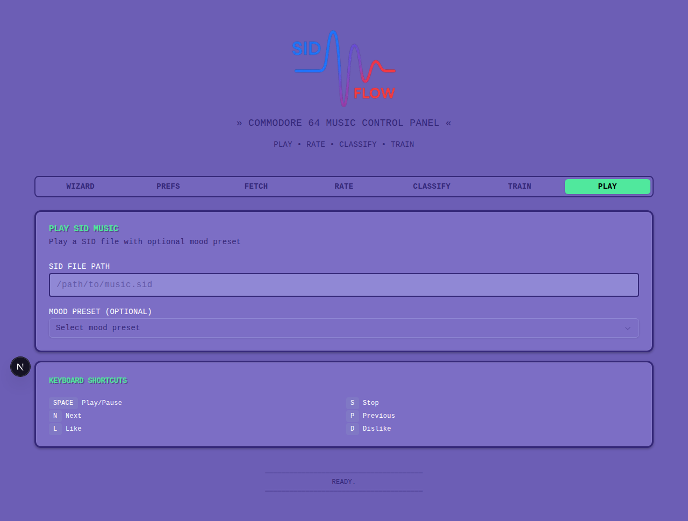

# SIDFlow Web UI Documentation

This document provides comprehensive visual documentation of the SIDFlow web interface, showcasing all features and tabs.

## Overview

The SIDFlow web interface is a Commodore 64-inspired control panel for managing your SID music collection. It features authentic C64 colors, multiple themes, and intuitive tab-based navigation.

## Screenshots

### 1. Wizard Tab

The Wizard tab guides you through the complete SIDFlow setup process with a step-by-step workflow.

**Features:**
- Progress indicator showing current step (1 of 5)
- Detailed explanation of each step
- "What Happens" information boxes
- Direct navigation to relevant tabs
- Overview of all steps at bottom

**Workflow Steps:**
1. **Fetch** - Download HVSC collection
2. **Rate** - Manually rate tracks
3. **Classify** - Analyze collection
4. **Train** - Train ML model
5. **Play** - Enjoy music

### 2. Preferences Tab

Configure your visual preferences including color schemes and fonts.

**Features:**
- **Color Schemes:**
  - C64 Light Blue (authentic C64 colors)
  - C64 Dark Mode (black background)
  - Classic Purple (original theme)
  - System Default (follows OS settings)
- **Font Families:**
  - C64 Font (Press Start 2P - authentic retro)
  - Monospace (Courier New)
  - Sans Serif (Arial/Helvetica)
- Color preview swatches
- Settings persist across sessions via localStorage
- Per-browser, per-device configuration

### 3. Fetch Tab

Download and synchronize the HVSC (High Voltage SID Collection).

**Features:**
- One-click HVSC download/update
- Clear explanation of operation
- Time estimates provided
- Optional configuration paths

**What Happens:**
- Downloads latest HVSC archive
- Extracts SID files to workspace
- Takes 5-10 minutes on first run

### 4. Rate Tab

Submit manual ratings for SID tracks to train the recommendation system.

**Features:**
- SID file path input
- Four rating dimensions with sliders:
  - **Energy** (1-5): Intensity level
  - **Mood** (1-5): Dark to Bright
  - **Complexity** (1-5): Simple to Complex
  - **Preference** (1-5): Personal taste
- Visual rating guide
- Real-time slider values
- Descriptive help text for each dimension

### 5. Play Tab

Play SID music with optional mood presets and keyboard controls.

**Features:**
- SID file path input
- Mood preset selection (Quiet, Ambient, Energetic, Dark, Bright, Complex)
- Keyboard shortcuts panel:
  - **SPACE** - Play/Pause
  - **S** - Stop
  - **N** - Next
  - **P** - Previous
  - **L** - Like
  - **D** - Dislike
- Playback controls (shown when playing)
- Position slider
- Like/Dislike quick rating buttons
- Current ratings display

## Design System

### Authentic C64 Colors

The interface uses the authentic Commodore 64 color palette:

- **Light Blue**: #6C5EB5 (C64's iconic light blue)
- **Dark Blue**: #352879 (C64's dark blue)
- **Light Green**: #50E89D (C64's light green for accents)
- **Black**: #000000 (dark mode background)

### Typography

- **Primary Font**: Courier New (monospace)
- **C64 Font**: Press Start 2P (optional, authentic C64 style)
- **Sans Serif**: Arial/Helvetica (optional)

### Visual Elements

- **Borders**: 3px solid with inner shadow (C64 style)
- **Text Shadow**: 2px PETSCII-inspired depth
- **Glow Effects**: Retro neon glow on interactive elements
- **Progress Bars**: C64-themed progress indicators

## Tab Navigation

Tabs are ordered to follow the typical workflow:

1. **WIZARD** - Getting started guide
2. **PREFS** - Configure appearance
3. **FETCH** - Download music collection
4. **RATE** - Provide manual ratings
5. **CLASSIFY** - Auto-classify tracks
6. **TRAIN** - Train ML model
7. **PLAY** - Play music

## Keyboard Shortcuts

The interface supports full keyboard navigation:

- **SPACE** - Play/Pause current track
- **S** - Stop playback
- **N** - Next track
- **P** - Previous track
- **L** - Like current track (rate 5/5)
- **D** - Dislike current track (rate 1/1)

## Storage & Persistence

- User preferences stored in browser localStorage
- Settings persist across server restarts
- Per-browser and per-device configuration
- No server-side user accounts required
- Privacy-first: all data stays local

## Responsive Design

- Adapts to desktop and mobile screens
- Tab grid: 4 columns on mobile, 7 columns on desktop
- Touch-friendly controls
- Scalable UI elements

## Browser Compatibility

- Modern browsers with ES6+ support
- localStorage API required
- Tested on Chrome, Firefox, Safari, Edge
- Requires JavaScript enabled

## Accessibility

- Semantic HTML structure
- ARIA labels and roles
- Keyboard navigation support
- High contrast color schemes
- Focus indicators on interactive elements

## Technical Stack

- **Next.js 15** - React framework
- **React 19** - UI library
- **TypeScript** - Type safety
- **Tailwind CSS** - Styling
- **shadcn/ui** - Component library
- **Bun** - Runtime and package manager

## Future Enhancements

- Additional color schemes (VIC-20, C128)
- Custom color picker
- Import/export preferences
- Cloud sync for preferences (optional)
- Additional keyboard shortcuts
- Gamepad support
- Accessibility improvements

## Getting Started

1. Start the web server: `cd packages/sidflow-web && bun run dev`
2. Open http://localhost:3000 in your browser
3. Click **WIZARD** tab to follow the setup guide
4. Configure preferences in **PREFS** tab
5. Start with **FETCH** to download music
6. **RATE** some tracks to train the system
7. **CLASSIFY** your collection
8. **TRAIN** the ML model
9. **PLAY** and enjoy!

## Support

For issues or questions:
- Check the [main README](../README.md)
- Read the [technical reference](technical-reference.md)
- Open an issue on GitHub

---

**Note:** All screenshots show the default C64 Light Blue theme. The interface appearance can be customized via the Preferences tab.
